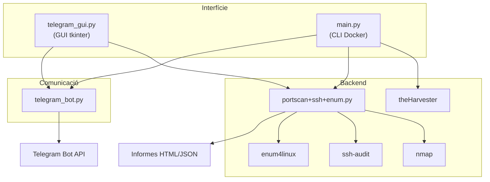

# Descripció General de l'Eina

## Eina d'Auditoria de Xarxa

Eina multi-protocol d'auditoria de seguretat de xarxa amb interfície GUI (tkinter) i mode CLI per a Docker.

Funcionalitats:

- **Descobriment d'hosts** a la xarxa local
- **Escaneig de ports** amb detecció de versions
- **Anàlisi de vulnerabilitats** amb Nmap Scripting Engine
- **Auditoria SSH** de configuració
- **Enumeració SMB** de recursos compartits
- **Recollida d'informació OSINT** amb theHarvester
- **Integració amb Telegram** per a enviament d'informes

Disposa d'una interfície gràfica basada en tkinter per a ús local i un mode CLI interactiu per a Docker, fent-la **completament portable**.

## Requisits del Sistema

### Execució Local (GUI)

| Requisit | Detalls |
|----------|---------|
| Python | 3.10 o superior |
| Llibreries pip | `python-nmap`, `requests` |
| nmap | Instal·lat al sistema operatiu |
| ssh-audit | Instal·lable via pip |
| enum4linux | Opcional, per a auditoria SMB |
| tkinter | Inclòs amb Python per defecte |

### Execució amb Docker (USB)

| Requisit | Detalls |
|----------|---------|
| Docker | Instal·lat a la màquina del client |
| Pantalla X11 | Per a la GUI (o mode terminal si no disponible) |

## Arquitectura

