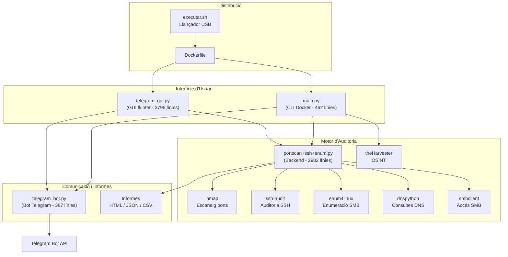
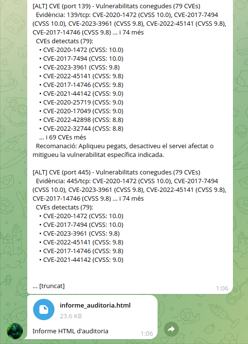
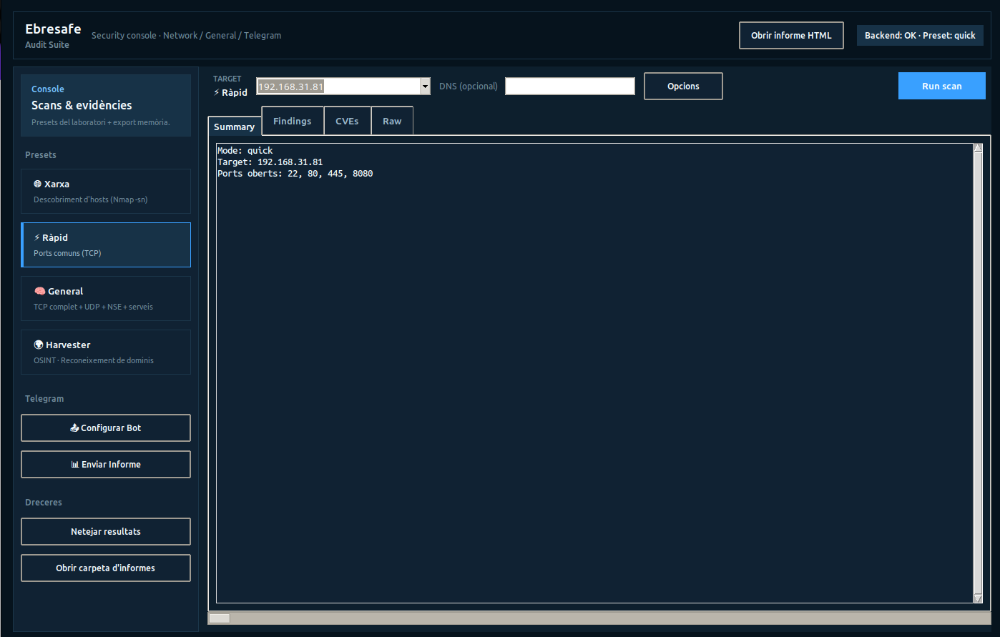

# Descripció General de l'Eina

## Eina d'Auditoria de Xarxa — EbreSafe

EbreSafe és una **eina multi-protocol d'auditoria de seguretat de xarxa** desenvolupada en Python 3, amb interfície gràfica (tkinter) i mode CLI per a Docker. Està dissenyada per realitzar auditories de seguretat complertes de forma automatitzada i portable.

### Característiques principals

| Característica | Descripció |
|----------------|------------|
| :material-radar: Descobriment d'hosts | Detecció de dispositius actius a la xarxa local |
| :material-lan: Escaneig de ports | Detecció de ports oberts i versions de serveis |
| :material-shield-alert: Anàlisi de vulnerabilitats | Scripts NSE, CVEs i auditoria integral |
| :material-ssh: Auditoria SSH | Anàlisi de configuració criptogràfica |
| :material-folder-network: Enumeració SMB | Descobriment de recursos compartits |
| :material-earth: OSINT | Reconeixement de dominis amb theHarvester |
| :material-send: Telegram | Enviament d'informes via bot |
| :material-docker: Docker | Distribució portable via USB |

### Tecnologies utilitzades

| Tecnologia | Ús |
|------------|-----|
| Python 3.12 | Llenguatge principal |
| tkinter | Interfície gràfica |
| nmap / python-nmap | Escaneig de xarxa |
| ssh-audit | Auditoria SSH |
| enum4linux | Enumeració SMB |
| theHarvester | Reconeixement OSINT |
| Docker | Contenització i portabilitat |
| Telegram Bot API | Enviament d'informes |
| dnspython | Consultes DNS avançades |

## Requisits del Sistema

### Execució Local (GUI)

| Requisit | Detalls |
|----------|---------| 
| Python | 3.10 o superior |
| Llibreries pip | `python-nmap`, `requests`, `dnspython`, `ssh-audit` |
| nmap | Instal·lat al sistema operatiu |
| ssh-audit | Instal·lable via pip |
| enum4linux | Opcional, per a auditoria SMB |
| tkinter | Inclòs amb Python per defecte |

### Fitxer `requirements.txt`

```txt
python-nmap>=0.7.1
requests>=2.28.0
dnspython>=2.6.1
ssh-audit>=3.3.0
```

### Execució amb Docker (USB)

| Requisit | Detalls |
|----------|---------| 
| Docker | Instal·lat a la màquina del client |
| Pantalla X11 | Per a la GUI (o mode terminal si no disponible) |

## Arquitectura de l'Eina



## Captures de pantalla — Visió general

!!! note "Captures"
    Insereix aquí captures generals de l'eina.

<!-- CAPTURA: Vista general de l'eina en execució -->
<!--  -->

<!-- CAPTURA: Pantalla principal de la GUI -->
<!--  -->
