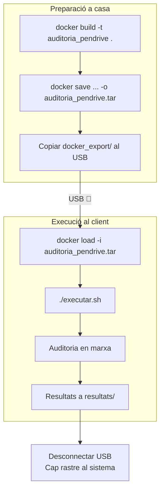

# Docker i USB

## Arquitectura i Objectiu

!!! info "Objectiu"
    Encapsular tota l'eina d'auditoria en un contenidor Docker portable: portar-lo en un USB, connectar-lo a qualsevol equip amb Docker instal·lat i executar-lo sense necessitat d'instal·lar res al sistema amfitrió.

## Dockerfile

La imatge es basa en `python:3.12-slim` i instal·la totes les eines necessàries:

```dockerfile
FROM python:3.12-slim

# Dependències del sistema: nmap, git, smbclient, GUI (tkinter/X11)
RUN apt-get update && apt-get install -y --no-install-recommends \
    nmap git smbclient samba-common-bin perl ldap-utils \
    iputils-ping net-tools python3-tk libx11-6 libxext6 \
    libxrender1 libxft2 fonts-noto-color-emoji fontconfig \
    && rm -rf /var/lib/apt/lists/*

# enum4linux des de GitHub (no disponible a apt de Debian Trixie)
RUN git clone https://github.com/CiscoCXSecurity/enum4linux.git /opt/enum4linux \
    && ln -s /opt/enum4linux/enum4linux.pl /usr/local/bin/enum4linux

WORKDIR /app
COPY requirements.txt /app/
RUN pip install --no-cache-dir -r requirements.txt
RUN pip install --no-cache-dir ssh-audit
RUN pip install --no-cache-dir git+https://github.com/laramies/theHarvester.git

COPY portscan+ssh+enum.py telegram_bot.py telegram_gui.py main.py /app/
RUN mkdir -p /app/dades

ENV DOCKER_CONTAINER=1
ENV REPORTS_DIR=/app/dades

ENTRYPOINT ["python", "telegram_gui.py"]
```

## Decisions Tècniques

| Decisió | Motiu |
|---------|-------|
| `python:3.12-slim` | theHarvester requereix Python >= 3.12 |
| enum4linux via GitHub | No existeix com a paquet apt a Debian Trixie |
| theHarvester via GitHub | El paquet PyPI és un placeholder (v0.0.1) |
| `--network host` | Per escanejar la xarxa real del host, no la xarxa interna Docker |
| `REPORTS_DIR` env var | Rutes configurables per persistència amb volums |

## Modificació del Backend

Les rutes dels informes es van fer configurables via la variable d'entorn `REPORTS_DIR`, permetent que funcioni tant dins com fora de Docker sense canvis:

```python
_REPORTS_BASE = os.environ.get("REPORTS_DIR", "")

if _REPORTS_BASE:
    FITXER_MESTRE_SMB = os.path.join(_REPORTS_BASE, "informe_auditoria_smb_mestre.json")
    FITXER_LOG = os.path.join(_REPORTS_BASE, "auditoria.log")
    DIRECTORI_REPORTS = os.path.join(_REPORTS_BASE, "informes_auditoria")
```

## Comandes Docker

### Construir la imatge

```bash
docker build -t auditoria_pendrive .
```

### Exportar al USB

```bash
docker save auditoria_pendrive -o docker_export/auditoria_pendrive.tar
```

### Executar

```bash
docker run -it --rm --network host \
    -v $(pwd)/resultats:/app/dades \
    auditoria_pendrive
```

## Flux USB complet


