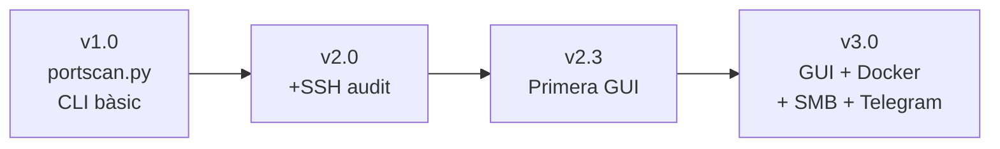

# Estructura i Funcionalitats

## Estructura del Projecte

| Fitxer / Carpeta | Descripció |
|------------------|------------|
| `telegram_gui.py` | GUI principal (tkinter) amb integració Telegram |
| `portscan+ssh+enum.py` | Backend d'auditoria (nmap, ssh-audit, enum4linux) |
| `telegram_bot.py` | Mòdul d'integració amb Telegram |
| `main.py` | CLI interactiu per a Docker amb theHarvester |
| `Dockerfile` | Definició de la imatge Docker |
| `.dockerignore` | Fitxers exclosos del build Docker |
| `requirements.txt` | Dependències Python (`python-nmap`, `requests`) |
| `telegram_config.json` | Configuració Telegram (token + chat_id) |
| `docker_export/` | Carpeta preparada per a distribució USB |
| `docker_export/executar.sh` | Llançador automàtic (GUI o Terminal) |
| `docker_export/auditoria_pendrive.tar` | Imatge Docker exportada |
| `resultats/` | Informes generats localment |
| `informes_auditoria/` | Informes JSON/HTML generats |

## Mòduls Funcionals

| Mòdul | Descripció |
|-------|------------|
| :material-radar: **Descobriment** | Ping scan de la xarxa local (`nmap -sn`) |
| :material-lan: **Ports i Serveis** | Escaneig de ports amb detecció de versions (`nmap -sV`) |
| :material-shield-alert: **Vulnerabilitats** | Anàlisi amb Nmap Scripting Engine (`--script vuln`) |
| :material-ssh: **Auditoria SSH** | Auditoria de configuració SSH (`ssh-audit`) |
| :material-folder-network: **Enumeració SMB** | Enumeració de recursos Windows/Samba (`enum4linux`) |
| :material-flash: **Escaneig Ràpid** | Escaneig ràpid dels ports principals |
| :material-earth: **OSINT** | Recollida d'informació pública (`theHarvester`) — només CLI |
| :material-send: **Telegram** | Enviament d'informes via bot de Telegram |

## Historial de Versions

| Versió | Fitxer | Descripció |
|--------|--------|------------|
| v1.0 | `portscan.py` *(eliminat)* | Escàner bàsic amb nmap (CLI) |
| v2.0 | `portscan+ssh.py` *(eliminat)* | Afegida auditoria SSH (CLI) |
| v2.3 | `portscan_gui.py` *(eliminat)* | Primera GUI (tkinter, sense Telegram) |
| v3.0 | `portscan+ssh+enum.py` | Backend actual amb SMB + rutes configurables |
| v3.0 | `telegram_gui.py` | GUI actual amb Telegram i informes HTML |
| v3.0 | `main.py` | CLI per a Docker amb integració theHarvester |

