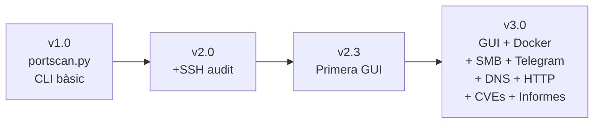

# Estructura i Funcionalitats

## Estructura de Fitxers del Projecte

| Fitxer / Carpeta | Descripció | Línies |
|------------------|------------|--------|
| `telegram_gui.py` | GUI principal (tkinter) amb integració Telegram | 3796 |
| `portscan+ssh+enum.py` | Backend d'auditoria (nmap, ssh-audit, enum4linux, DNS, HTTP, FTP, SMB, MariaDB) | 2982 |
| `main.py` | CLI interactiu per a Docker amb theHarvester | 462 |
| `telegram_bot.py` | Mòdul d'integració amb Telegram | 367 |
| `Dockerfile` | Definició de la imatge Docker | 70 |
| `.dockerignore` | Fitxers exclosos del build Docker | — |
| `requirements.txt` | Dependències Python | 4 |
| `telegram_config.json` | Configuració Telegram (token + chat_id) | — |
| `executar.sh` | Llançador automàtic USB (GUI o Terminal) | 109 |
| `informes_auditoria/` | Informes JSON/HTML/CSV generats | — |

---

## Fitxer 1: `portscan+ssh+enum.py` — Motor d'Auditoria

Aquest és el **nucli de l'eina**. Conté tota la lògica d'escaneig i anàlisi de vulnerabilitats. Està organitzat en seccions funcionals:

### 1.1 Imports i configuració inicial

```python
#!/usr/bin/env python3
"""
Eina d'Auditoria Multi-Protocol (V 2.0)
Millores: colors, validació, threading, logging, export múltiple
"""

import nmap
import sys
import socket
import subprocess
import json
import shutil
import re
import os
import logging
import threading
import ftplib
import html
import importlib.util
import time
from datetime import datetime
from concurrent.futures import ThreadPoolExecutor, as_completed
from typing import Dict, List, Optional, Tuple
import ipaddress
from urllib.error import HTTPError, URLError
from urllib.parse import urljoin
from urllib.request import Request, urlopen
```

!!! info "Llibreries externes opcionals"
    S'importen amb `try/except` per funcionar fins i tot si no estan disponibles:
    
    - `requests` — Per a peticions HTTP avançades
    - `dnspython` — Per a consultes DNS (version.bind, AXFR, recursió)

### 1.2 Configuració de rutes i logging

```python
# Si REPORTS_DIR està definida (Docker), guardem tot al volum muntat
_REPORTS_BASE = os.environ.get("REPORTS_DIR", "")
if _REPORTS_BASE:
    FITXER_MESTRE_SMB = os.path.join(_REPORTS_BASE, "informe_auditoria_smb_mestre.json")
    FITXER_LOG = os.path.join(_REPORTS_BASE, "auditoria.log")
    DIRECTORI_REPORTS = os.path.join(_REPORTS_BASE, "informes_auditoria")
else:
    FITXER_MESTRE_SMB = "informe_auditoria_smb_mestre.json"
    FITXER_LOG = "auditoria.log"
    DIRECTORI_REPORTS = "informes_auditoria"

# Configuració del logging
logging.basicConfig(
    level=logging.INFO,
    format='%(asctime)s - %(levelname)s - %(message)s',
    handlers=[
        logging.FileHandler(FITXER_LOG),
        logging.StreamHandler(sys.stdout)
    ]
)
```

Això permet que els informes es guardin al volum Docker muntat (`/app/dades`) o a la carpeta local.

### 1.3 Validació d'entrada

```python
def validar_ip(ip: str) -> bool:
    """Valida si una IP és vàlida (IPv4 o IPv6)."""
    try:
        ipaddress.ip_address(ip)
        return True
    except ValueError:
        return False

def validar_xarxa(xarxa: str) -> bool:
    """Valida si una xarxa CIDR és vàlida."""
    try:
        ipaddress.ip_network(xarxa, strict=False)
        return True
    except ValueError:
        return False
```

### 1.4 Funcions de xarxa auxiliars

```python
def ip_local() -> str:
    """Obté la IP local de la interfície principal."""
    s = socket.socket(socket.AF_INET, socket.SOCK_DGRAM)
    try:
        s.connect(('8.8.8.8', 1))
        ip = s.getsockname()[0]
    except Exception:
        ip = '127.0.0.1'
    finally:
        s.close()
    return ip

def calc_xarxa(ip: str) -> str:
    """Calcula la subxarxa /24."""
    parts = ip.split('.')
    return f"{parts[0]}.{parts[1]}.{parts[2]}.0/24"
```

### 1.5 Sistema de troballes (findings)

L'eina utilitza un sistema unificat de troballes amb nivells de severitat:

```python
SEVERITY_ORDER = {
    'CRITIC': 0,
    'ALT': 1,
    'MITJA': 2,
    'BAIXA': 3,
    'INFO': 4
}

def afegir_troballa(
    troballes: List[Dict],
    service: str,
    title: str,
    severity: str,
    evidence: str,
    recommendation: str,
    port: Optional[int] = None,
    cve: Optional[List[Dict]] = None
):
    """Afegeix una troballa estructurada."""
    troballa = {
        'service': service,
        'title': title,
        'severity': severity,
        'port': port,
        'evidence': resumir_text(evidence),
        'recommendation': recommendation
    }
    if cve:
        troballa['cve'] = cve
    troballes.append(troballa)
```

### 1.6 Mòdul d'auditoria HTTP

Comprova capçaleres de seguretat, directory listing, fitxers sensibles i panells d'administració:

```python
HTTP_SECURITY_HEADERS = {
    'x-frame-options': 'Falta X-Frame-Options',
    'x-content-type-options': 'Falta X-Content-Type-Options',
    'content-security-policy': 'Falta Content-Security-Policy',
    'referrer-policy': 'Falta Referrer-Policy'
}

HTTP_SENSITIVE_PATHS = [
    '/.env', '/backup.sql.bak', '/backup.zip',
    '/web.sql.bak', '/db.sql', '/database.sql',
    '/config.php.bak', '/server-status'
]

def auditar_http(target: str, port: int, service_name: str) -> Dict:
    """Comprovacions específiques per a serveis web."""
    # Comprova:
    # 1. Capçaleres de seguretat (X-Frame-Options, CSP, etc.)
    # 2. Directory listing actiu
    # 3. Fitxers sensibles exposats (.env, backups, dumps SQL)
    # 4. Panells d'administració (phpMyAdmin, WordPress, etc.)
    # 5. Divulgació de versió del servidor
    ...
```

### 1.7 Mòdul d'auditoria FTP

```python
def auditar_ftp(target: str, port: int = 21) -> Dict:
    """Comprovacions específiques per a FTP."""
    # Comprova:
    # 1. Accés anònim permès
    # 2. Fitxers sensibles exposats (backup.sql, inventari.txt...)
    # 3. Divulgació de banner
    # 4. Protocol sense xifrat
    ...
```

### 1.8 Mòdul d'auditoria DNS

```python
def auditar_dns(target: str, port: int = 53, dns_domain: Optional[str] = None) -> Dict:
    """Comprovacions específiques per a BIND/DNS."""
    # Comprova:
    # 1. Divulgació de versió de BIND (version.bind)
    # 2. Recursió DNS activada
    # 3. Transferència de zona (AXFR) permesa
    ...
```

### 1.9 Mòdul d'auditoria SMB/Samba

```python
def auditar_smb(target: str) -> Dict:
    """Comprovacions específiques per a Samba/SMB."""
    # Comprova:
    # 1. Enumeració anònima de shares
    # 2. Accés anònim als recursos compartits
    # 3. Fitxers sensibles exposats (backup.sql, config_old, etc.)
    ...
```

### 1.10 Mòdul d'auditoria SSH

```python
def auditar_ssh(target: str, port: int = 22) -> Dict:
    """Resumeix els resultats de ssh-audit."""
    # Comprova:
    # 1. Algorismes criptogràfics insegurs (kex, key, enc, mac)
    # 2. Problemes crítics vs advertències
    # 3. Banner del servidor
    ...
```

### 1.11 Mòdul d'auditoria MySQL/MariaDB

```python
def auditar_mysql(target: str, port: int = 3306) -> Dict:
    """Comprovacions específiques per a MySQL/MariaDB."""
    # Comprova:
    # 1. Base de dades exposada remotament
    # 2. Divulgació de versió via banner
    ...
```

### 1.12 Detecció de CVEs amb vulners

```python
def extreure_cves_vulners(output: str) -> List[Dict]:
    """Extreu CVEs i puntuacions CVSS de la sortida del script vulners de Nmap."""
    cves: List[Dict] = []
    for match in re.finditer(
        r'(CVE-\d{4}-\d{4,})[^\S\r\n]+(10(?:\.0)?|[0-9](?:\.[0-9])?)\b', output
    ):
        cve_id = match.group(1)
        score = float(match.group(2))
        cves.append({'id': cve_id, 'cvss': score})
    return sorted(cves, key=lambda x: x['cvss'], reverse=True)
```

### 1.13 Exportació d'informes (HTML, JSON, CSV)

```python
def exportar_resultats(dades: List[Dict], nom_base: str):
    """Exporta resultats en múltiples formats."""
    # Genera:
    # 1. Fitxer JSON complet amb totes les dades
    # 2. Informe HTML estilitzat amb CSS modern
    # 3. Taula CSV per a memòria (servei/node/vuln/evidència/risc/recomanació)
    ...
```

### 1.14 Auditoria integral de laboratori

```python
def auditar_laboratori(target: str, dns_domain: Optional[str] = None) -> Dict:
    """Executa una auditoria integral orientada al laboratori ASIX."""
    # Executa tots els mòduls en cadena:
    # 1. Escaneig de ports amb nmap -sV
    # 2. Per cada servei detectat, executa el mòdul corresponent
    # 3. Executa vulners per detectar CVEs
    # 4. Genera resum amb severitats i estadístiques
    # 5. Exporta en HTML/JSON/CSV
    ...
```

### 1.15 Auditoria general (profunda)

```python
def auditar_general(target: str, ...) -> Dict:
    """Auditoria general més profunda: TCP complet + UDP + NSE."""
    # Afegeix:
    # 1. Escaneig TCP complet (-p-)
    # 2. Escaneig UDP de ports típics
    # 3. Scripts NSE (vulners, ftp-anon, smb-enum-shares, etc.)
    # 4. Detecció de serveis addicionals (DHCP, TFTP, Redis, etc.)
    ...
```

<!-- CAPTURA: Sortida d'un escaneig a la terminal -->

---

## Fitxer 2: `telegram_gui.py` — Interfície Gràfica

La GUI és l'**interfície principal** de l'eina. Utilitza `tkinter` amb un disseny fosc professional.

### 2.1 Classe `AnimatedButton`

```python
class AnimatedButton(tk.Button):
    """Botó amb animacions de hover i click."""
    
    def __init__(self, parent, **kwargs):
        self.normal_bg = kwargs.pop('normal_bg', '#5294e2')
        self.hover_bg = kwargs.pop('hover_bg', '#3d7bc7')
        self.active_bg = kwargs.pop('active_bg', '#2a5f9e')
        # Efectes d'animació en hover i click
        self.bind('<Enter>', self._on_enter)
        self.bind('<Leave>', self._on_leave)
        self.bind('<Button-1>', self._on_press)
```

### 2.2 Paleta de colors

```python
class Colors:
    """Paleta de colors per a la interfície."""
    BG_DARK = '#06131d'
    BG_MEDIUM = '#0d1f2d'
    BG_LIGHT = '#13283a'
    BG_PANEL = '#102233'
    PRIMARY = '#39a0ff'
    ACCENT = '#7df9c1'
    SUCCESS = '#26c6a0'
    WARNING = '#ffb020'
    DANGER = '#ff5d73'
    TEXT_PRIMARY = '#f4fbff'
    TEXT_SECONDARY = '#9bb8cb'
```

### 2.3 Sistema d'informes HTML unificat

```python
class HTMLReport:
    """Sistema d'informes HTML amb persistència JSON robusta."""
    
    def afegir_auditoria(self, tipus, target, resultats):
        """Afegeix o actualitza una auditoria."""
        # Les auditories s'acumulen en un fitxer JSON
        # i es regenera l'HTML complet amb CSS modern
        ...
    
    def _regenerar_html(self):
        """Regenera l'HTML amb un disseny modern amb gradient fosc."""
        # Utilitza CSS amb variables, animacions i responsive design
        ...
```

### 2.4 Classe principal `AuditoriaGUI`

```python
class AuditoriaGUI:
    """Classe principal de la GUI."""
    
    def __init__(self, root):
        self.root = root
        self.root.title("ASIX Audit Control Center")
        self.root.geometry("1420x920")
        
        # Gestió d'historial d'IPs
        self.historial = HistorialManager()
        
        # Gestor d'informes HTML unificat
        self.html_report = HTMLReport()
        
        # Crear interfície amb pestanyes
        self.crear_interficie()
        ...
```

La GUI conté pestanyes per a:

- **Descobriment** — Ping scan de la xarxa
- **Ports i Serveis** — Escaneig nmap -sV
- **Escaneig General** — TCP complet + UDP + NSE
- **Vulnerabilitats** — Auditoria integral
- **SSH** — ssh-audit
- **SMB** — enum4linux / smbclient
- **Escaneig Ràpid** — Threading amb sockets
- **Telegram** — Configuració i enviament
- **Eines** — Estat de les eines instal·lades

<!-- CAPTURA: Interfície GUI amb pestanyes -->
<!--  -->

---

## Fitxer 3: `telegram_bot.py` — Integració Telegram

### 3.1 Càrrega de configuració

```python
def load_telegram_config() -> Dict[str, str]:
    """
    Carrega la configuració de Telegram.
    Prioritat:
    1. Variables d'entorn (TELEGRAM_BOT_TOKEN, TELEGRAM_CHAT_ID)
    2. Fitxer de configuració JSON (telegram_config.json)
    """
    env_token = os.environ.get('TELEGRAM_BOT_TOKEN', '')
    env_chat_id = os.environ.get('TELEGRAM_CHAT_ID', '')
    
    if env_token:
        return {'token': env_token, 'chat_id': env_chat_id}
    
    # Si no hi ha variables d'entorn, carregar del fitxer
    try:
        if os.path.exists(CONFIG_FILE):
            with open(CONFIG_FILE, 'r', encoding='utf-8') as f:
                return json.load(f)
    except Exception as e:
        print(f"Error carregant configuració Telegram: {e}")
    return {'token': '', 'chat_id': ''}
```

### 3.2 Enviament de missatges i documents

```python
def send_telegram_message(message: str, token=None, chat_id=None, 
                          parse_mode="Markdown") -> Tuple[bool, str]:
    """Envia un missatge a un xat de Telegram."""
    url = TELEGRAM_API_URL.format(token=token, method="sendMessage")
    payload = {'chat_id': chat_id, 'text': message}
    response = requests.post(url, json=payload, timeout=10)
    ...

def send_telegram_document(file_path: str, caption: str = "", ...) -> Tuple[bool, str]:
    """Envia un document/fitxer a un xat de Telegram."""
    url = TELEGRAM_API_URL.format(token=token, method="sendDocument")
    with open(file_path, 'rb') as f:
        files = {'document': (os.path.basename(file_path), f)}
        response = requests.post(url, data=data, files=files, timeout=30)
    ...
```

### 3.3 Format dels informes per Telegram

```python
def format_audit_report(tool_name, target, results, ...) -> str:
    """Formata un informe d'auditoria per enviar a Telegram."""
    # Genera un missatge amb:
    # - Capçalera amb eina, objectiu i data
    # - Comptador d'alertes detectades
    # - Resultats en bloc de codi
    # - Truncament automàtic si supera 4096 caràcters
    ...
```

### 3.4 Test de connexió

```python
def test_connection(token=None, chat_id=None) -> Tuple[bool, str]:
    """Comprova la connexió amb el bot de Telegram."""
    # 1. Verifica el token amb getMe
    # 2. Si hi ha chat_id, envia missatge de prova
    # 3. Retorna el nom del bot si tot funciona
    ...
```

<!-- CAPTURA: Configuració Telegram a la GUI -->

---

## Fitxer 4: `main.py` — CLI per a Docker

### 4.1 Punt d'entrada i detecció d'entorn

```python
def obtenir_directori_dades() -> str:
    """Calcula un directori de resultats vàlid tant en Docker com en local."""
    reports_dir = os.environ.get("REPORTS_DIR")
    if reports_dir:
        return reports_dir
    is_docker = os.environ.get("DOCKER_CONTAINER", "0") == "1"
    if is_docker:
        return "/app/dades"
    return os.path.join(BASE_DIR, "resultats")

def preferir_gui() -> bool:
    """Decideix si cal obrir la GUI en lloc de la CLI."""
    if os.environ.get("DOCKER_CONTAINER", "0") == "1":
        return False
    if "--cli" in sys.argv:
        return False
    return entorn_grafic_disponible() and tkinter_disponible()
```

### 4.2 Menú principal CLI

```python
def menu():
    """Mostra el menú principal."""
    opcions = [
        ("1", "🔍 DESCOBRIMENT D'HOSTS",         "Ping Scan de la xarxa local"),
        ("2", "🔓 ESCANEIG DE PORTS I SERVEIS",   "Nmap -sV"),
        ("3", "🧠 ESCANEIG GENERAL",              "TCP complet + UDP + NSE"),
        ("4", "🛡️  ANÀLISI DE VULNERABILITATS",   "Auditoria integral"),
        ("5", "🔐 AUDITORIA SSH",                 "ssh-audit"),
        ("6", "🗂️  ENUMERACIÓ SMB/WINDOWS",        "enum4linux o smbclient"),
        ("7", "⚡ ESCANEIG RÀPID DE PORTS",       "Ports comuns"),
        ("8", "🌐 THE HARVESTER (OSINT)",         "Reconeixement de dominis"),
        ("9", "⚙️  ESTAT DE LES EINES",           "Verificar instal·lacions"),
        ("10","📊 VEURE INFORMES",                "Llistar fitxers generats"),
        ("0", "❌ SORTIR",                        "Tancar l'aplicació"),
    ]
```

### 4.3 Integració de theHarvester

```python
def executar_theharvester():
    """Executa theHarvester per a reconeixement de dominis."""
    domini = input("Domini objectiu (ex: example.com): ").strip()
    
    # Validació del domini amb regex
    if not validar_domini(domini):
        print("✗ Domini invàlid.")
        return
    
    # Fonts disponibles
    fonts = ["all", "bing", "google", "yahoo", "duckduckgo", "baidu", "virustotal"]
    
    # Execució amb subprocess
    resultat = subprocess.run(
        ["theHarvester", "-d", domini, "-b", font_sel, "-f", ruta_guardat],
        capture_output=True, text=True, timeout=300
    )
```

<!-- CAPTURA: Menú CLI dins de Docker -->

---

## Fitxer 5: `Dockerfile` — Contenització

```dockerfile
# Imatge base de Python lleugera
FROM python:3.12-slim

# Dependències del sistema
RUN apt-get update && apt-get install -y --no-install-recommends \
    nmap git smbclient samba-common-bin perl ldap-utils \
    iputils-ping net-tools python3-tk libx11-6 libxext6 \
    libxrender1 libxft2 fonts-noto-color-emoji fontconfig \
    && rm -rf /var/lib/apt/lists/*

# enum4linux des de GitHub
RUN git clone https://github.com/CiscoCXSecurity/enum4linux.git /opt/enum4linux \
    && ln -s /opt/enum4linux/enum4linux.pl /usr/local/bin/enum4linux

WORKDIR /app
COPY requirements.txt /app/
RUN pip install --no-cache-dir -r requirements.txt
RUN pip install --no-cache-dir ssh-audit
RUN pip install --no-cache-dir git+https://github.com/laramies/theHarvester.git

COPY portscan+ssh+enum.py telegram_bot.py telegram_gui.py main.py /app/
RUN mkdir -p /app/dades

ENV DOCKER_CONTAINER=1
ENV REPORTS_DIR=/app/dades

ENTRYPOINT ["python", "telegram_gui.py"]
```

---

## Fitxer 6: `executar.sh` — Llançador USB

```bash
#!/bin/bash
# Detecta automàticament GUI o Terminal

# 1. Comprovar Docker instal·lat
# 2. Comprovar permisos de Docker
# 3. Carregar la imatge si no existeix (.tar o .tar.gz)
# 4. Crear carpeta de resultats
# 5. Detectar telegram_config.json
# 6. Detectar pantalla disponible

if [ -n "$DISPLAY" ]; then
    # MODE GUI
    docker run -it --rm --network host \
        -e DISPLAY="$DISPLAY" \
        -v /tmp/.X11-unix:/tmp/.X11-unix \
        -v "$RESULTATS":/app/dades \
        "$IMATGE"
else
    # MODE TERMINAL
    docker run -it --rm --network host \
        -v "$RESULTATS":/app/dades \
        --entrypoint python \
        "$IMATGE" main.py
fi
```

---

## Historial de Versions

| Versió | Fitxer | Descripció |
|--------|--------|------------|
| v1.0 | `portscan.py` *(eliminat)* | Escàner bàsic amb nmap (CLI) |
| v2.0 | `portscan+ssh.py` *(eliminat)* | Afegida auditoria SSH (CLI) |
| v2.3 | `portscan_gui.py` *(eliminat)* | Primera GUI (tkinter, sense Telegram) |
| v3.0 | `portscan+ssh+enum.py` | Backend actual amb SMB + DNS + HTTP + rutes configurables |
| v3.0 | `telegram_gui.py` | GUI actual amb Telegram, informes HTML i animacions |
| v3.0 | `main.py` | CLI per a Docker amb integració theHarvester |
| v3.0 | `telegram_bot.py` | Mòdul d'integració amb Telegram |


