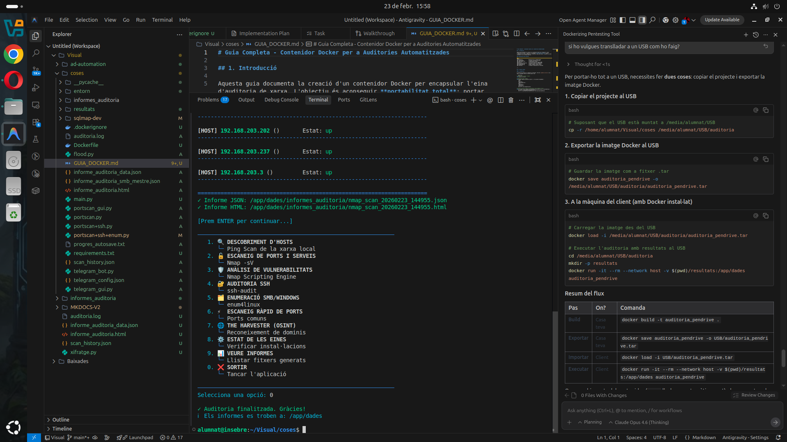
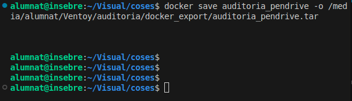
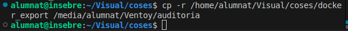
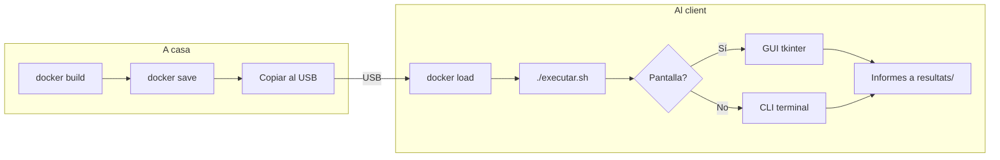
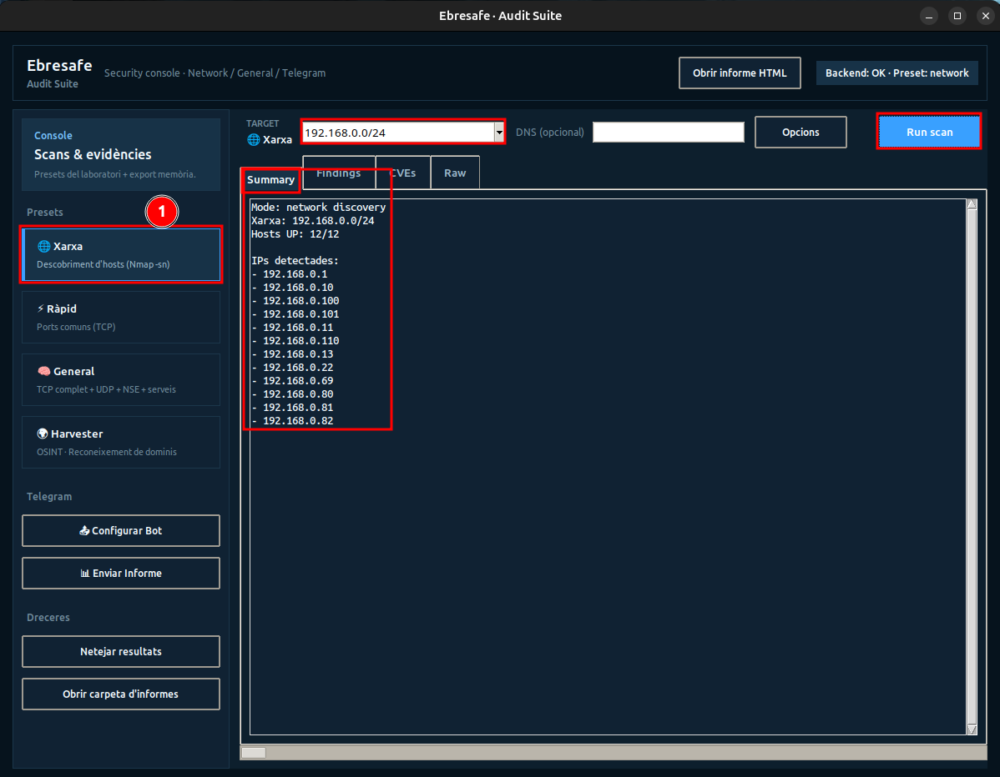
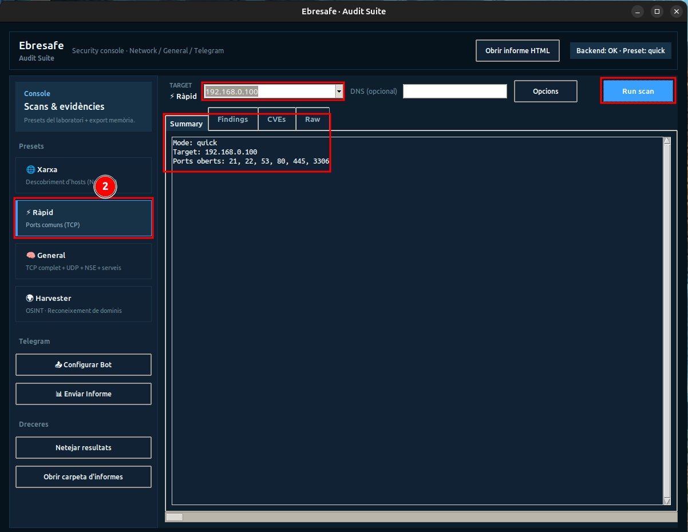
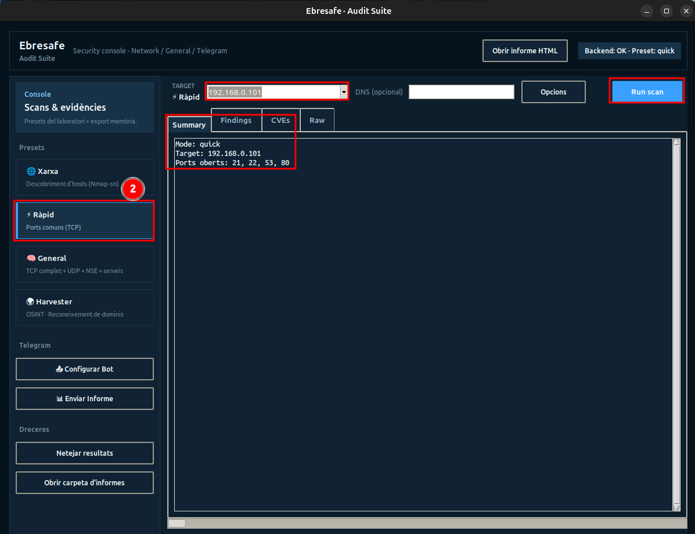
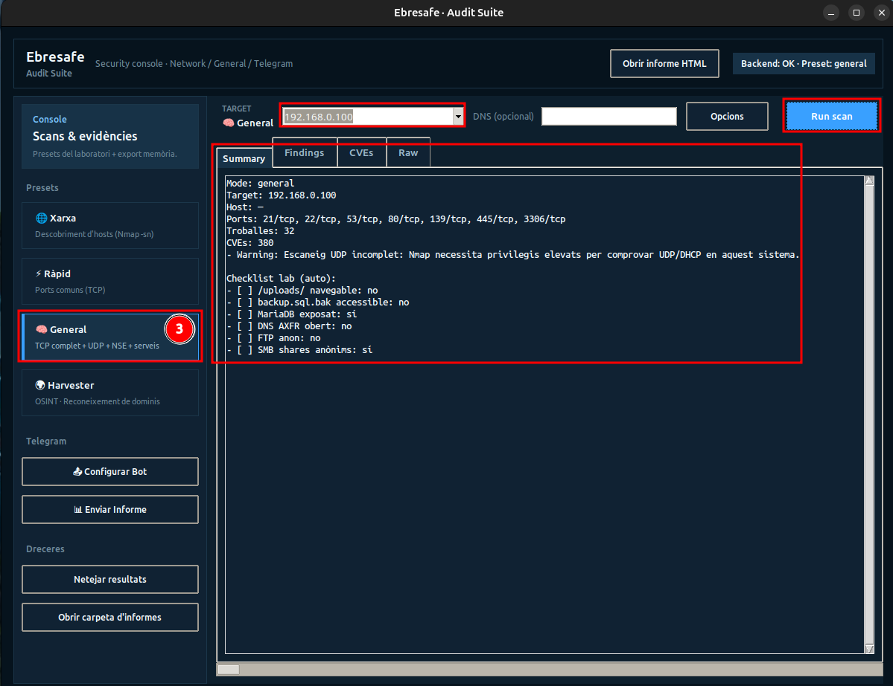
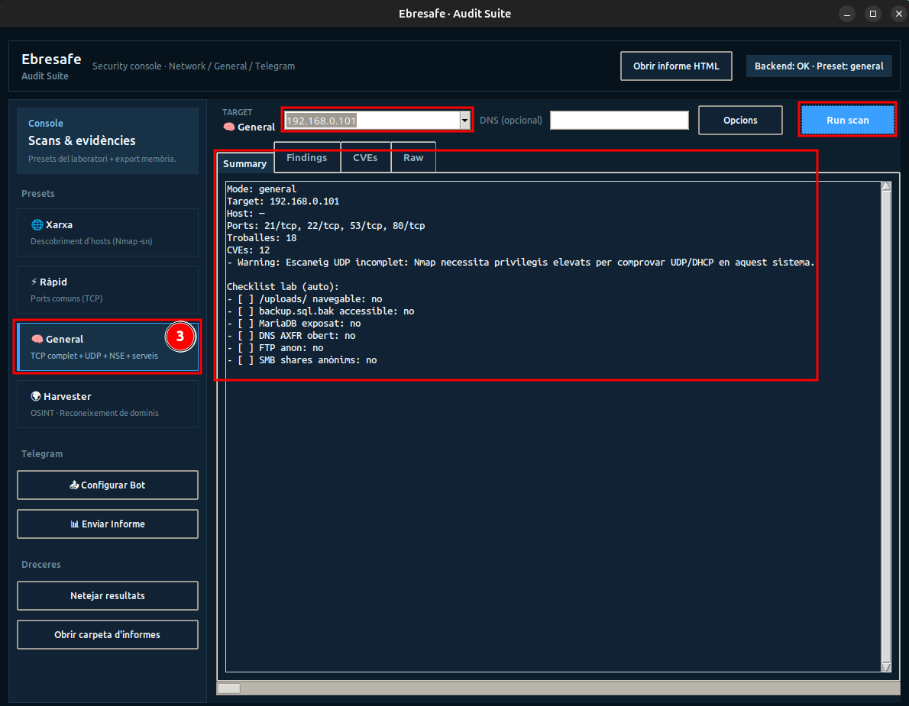
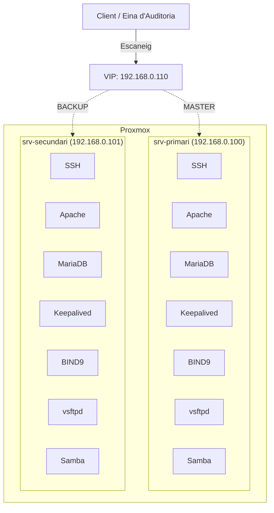

# Manual d'Usuari

## Índex

1. [Instal·lació](#installacio)
2. [Mode Local (GUI)](#mode-local-gui)
3. [Mode Docker (USB)](#mode-docker-usb)
4. [Guia de cada mòdul](#guia-de-cada-modul)
5. [Configuració de Telegram](#configuracio-de-telegram)
6. [Informes generats](#informes-generats)
7. [Escenari del laboratori](#escenari-del-laboratori)
8. [Resolució de problemes](#resolucio-de-problemes)

---

## Instal·lació {#installacio}

### Opció A: Instal·lació local

```bash
# 1. Clonar el repositori
git clone https://github.com/jordicerv/projecte_ebresafe.git

# 2. Crear entorn virtual
python3 -m venv entorn
source entorn/bin/activate

# 3. Instal·lar dependències Python
pip install python-nmap requests dnspython ssh-audit

# 4. Instal·lar eines del sistema
sudo apt install -y nmap smbclient samba-common-bin

# 5. Instal·lar enum4linux (opcional)
git clone https://github.com/CiscoCXSecurity/enum4linux.git /tmp/enum4linux
sudo ln -sf /tmp/enum4linux/enum4linux.pl /usr/local/bin/enum4linux
sudo chmod +x /tmp/enum4linux/enum4linux.pl
```

### Opció B: Instal·lació amb Docker

```bash
# 1. Construir la imatge
docker build -t auditoria_pendrive .

# 2. Executar directament
docker run -it --rm --network host \
    -e DISPLAY="$DISPLAY" \
    -v /tmp/.X11-unix:/tmp/.X11-unix \
    -v $(pwd)/resultats:/app/dades \
    auditoria_pendrive
```

| Paràmetre | Funció |
|-----------|--------|
| `-it` | Mode interactiu |
| `--rm` | Esborra el contenidor en sortir |
| `--network host` | Utilitza la xarxa real del host (necessari per escanejar hosts reals) |
| `-v $(pwd)/resultats:/app/dades` | Persistència dels informes al host |
| `-e DISPLAY` + `-v /tmp/.X11-unix` | Permet obrir la GUI des de Docker |

---

## Mode Local (GUI) {#mode-local-gui}

### Iniciar l'eina

```bash
# Activar l'entorn virtual
source entorn/bin/activate

# Executar la GUI
python telegram_gui.py
```

La interfície s'obre amb una finestra de 1420x920 píxels amb un disseny fosc professional. A l'esquerra hi ha el **panell de navegació** amb els presets d'escaneig (Xarxa, Ràpid, General, Harvester) i les opcions de Telegram. A la part central hi ha el camp per introduir l'objectiu (TARGET), el botó **Run scan** i les pestanyes de resultats (Summary, Findings, CVEs, Raw).

**Elements de la interfície:**

| Element | Funció |
|---------|--------|
| **Presets** (esquerra) | Xarxa, Ràpid, General, Harvester — seleccionen el mode d'escaneig |
| **TARGET** | Camp per introduir la IP o domini objectiu |
| **DNS (opcional)** | Camp per al domini DNS (per provar AXFR) |
| **Opcions** | Opcions avançades de l'escaneig |
| **Run scan** | Botó per llançar l'escaneig |
| **Summary / Findings / CVEs / Raw** | Pestanyes de resultats |
| **Configurar Bot** | Obre la configuració de Telegram |
| **Enviar Informe** | Envia l'informe via Telegram |
| **Netejar resultats** | Esborra la pantalla de resultats |
| **Obrir carpeta d'informes** | Obre la carpeta amb els informes generats |

---

## Mode Docker (USB) {#mode-docker-usb}

### Preparació del USB (a casa)

**Pas 1:** Construir la imatge Docker i exportar-la al USB.



A la captura es veu l'entorn complet: VS Code amb l'estructura de fitxers, la guia Docker oberta, l'eina CLI executant-se al terminal amb el menú principal visible, i els informes generats.

**Pas 2:** Exportar la imatge Docker amb `docker save`:

```bash
docker save auditoria_pendrive -o /media/alumnat/USB/docker_export/auditoria_pendrive.tar
```



**Pas 3:** Copiar la carpeta del projecte al USB:

```bash
cp -r /home/alumnat/Visual/coses/docker_export /media/alumnat/USB/auditoria
```



### Execució al client

```bash
# 1. Connectar el USB
cd /media/.../docker_export

# 2. Donar permisos al llançador
chmod +x executar.sh

# 3. Executar
./executar.sh
```

El script `executar.sh` fa el següent automàticament:

1. ✅ Comprova que Docker està instal·lat
2. ✅ Comprova permisos
3. ✅ Carrega la imatge des del `.tar` si cal
4. ✅ Crea la carpeta `resultats/`
5. ✅ Detecta si hi ha `telegram_config.json`
6. ✅ Decideix entre **mode GUI** (si hi ha pantalla) o **mode terminal**



---

## Guia de cada mòdul {#guia-de-cada-modul}

### 1. Preset Xarxa — Descobriment d'hosts

**Què fa:** Escaneja la subxarxa local per trobar dispositius actius (ping scan amb `nmap -sn`).

**Com utilitzar-lo:**

1. Seleccionar el preset **Xarxa** al panell esquerre
2. Clicar **Run scan**
3. L'eina calcula automàticament la subxarxa /24 de la interfície activa
4. Es mostra una llista dels hosts trobats amb la seva IP i estat



A la captura es veu el resultat del descobriment de xarxa: **12 hosts actius** detectats, incloent els servidors del laboratori (192.168.0.100, 192.168.0.101) i la VIP (192.168.0.110).

---

### 2. Preset Ràpid — Escaneig ràpid de ports

**Què fa:** Escaneig ràpid per sockets (sense nmap) dels ports més comuns: `21, 22, 23, 25, 53, 80, 110, 143, 443, 445, 3306, 3389, 5432, 8080`.

**Com utilitzar-lo:**

1. Seleccionar el preset **Ràpid**
2. Introduir la IP objectiu
3. Clicar **Run scan**
4. Es mostren els ports oberts trobats



A la captura es veu l'escaneig ràpid del **servidor primari** amb 6 ports oberts detectats, incloent el port 3306 (MariaDB) i el 445 (SMB) que més tard es corregiran.



Al **servidor secundari** (després de les correccions) es detecten 4 ports oberts. Noteu que el port 3306 ja no apareix (MariaDB restringit a localhost) i el 445 tampoc (SMB securitzat).

---

### 3. Preset General — Escaneig complet

**Què fa:** Auditoria profunda que inclou:

- Escaneig TCP complet de tots els 65535 ports (`-p-`)
- Escaneig UDP dels ports més comuns
- Scripts NSE (vulners, ftp-anon, smb-enum-shares, etc.)
- Detecció de CVEs amb puntuació CVSS
- Checklist automàtic del laboratori

**Com utilitzar-lo:**

1. Seleccionar el preset **General**
2. Introduir la IP objectiu
3. Opcionalment, introduir un domini DNS per provar AXFR
4. Clicar **Run scan**

!!! warning "Temps d'execució"
    L'escaneig general pot trigar diversos minuts depenent de la xarxa i el nombre de ports oberts.



A la captura del **servidor primari** (abans de correccions) es veu:

- **Ports detectats:** 21/tcp, 22/tcp, 53/tcp, 80/tcp, 139/tcp, 445/tcp, 3306/tcp
- **32 troballes** de seguretat identificades
- **380 CVEs** associades als serveis detectats
- **Checklist del laboratori:** MariaDB exposat (**sí**), SMB shares anònims (**sí**)



Al **servidor secundari** (després de correccions) es veu la millora:

- **Ports detectats:** 21/tcp, 22/tcp, 53/tcp, 80/tcp (sense 139, 445 ni 3306)
- **18 troballes** (vs 32 anteriors)
- **12 CVEs** (vs 380 anteriors — una **reducció del 97%**)
- **Checklist:** Tot en **no** — totes les vulnerabilitats del laboratori han estat corregides

!!! success "Comparativa abans/després"
    Aquestes dues captures demostren l'eficàcia del procés de bastionament documentat a la secció [Correcció de vulnerabilitats](../laboratori/arreglar_vulnerabilitats.md).

---

### 4. Preset Harvester — OSINT

**Què fa:** Reconeixement de dominis públics mitjançant theHarvester. Busca:

- Correus electrònics associats
- Subdominis
- IPs públiques
- Informació pública disponible a motors de cerca

**Fonts disponibles:** `all`, `bing`, `google`, `yahoo`, `duckduckgo`, `baidu`, `virustotal`

**Com utilitzar-lo:**

1. Seleccionar el preset **Harvester**
2. Introduir el domini objectiu al camp TARGET (ex: `insebre.cat`)
3. Opcionalment, introduir la font al camp **Font** (per defecte: `all`)
4. Clicar **Run scan**

---

## Configuració de Telegram {#configuracio-de-telegram}

### Crear un bot de Telegram

1. Obre Telegram i cerca **@BotFather**
2. Envia `/newbot` i segueix les instruccions
3. Guarda el **token** que et dona el BotFather
4. Per obtenir el **Chat ID**:
    - Afegeix el bot al grup o inicia una conversa privada
    - Envia qualsevol missatge al bot
    - Visita: `https://api.telegram.org/bot<TOKEN>/getUpdates`
    - Busca `"chat":{"id": XXXXXXX}`

### Mètodes de configuració

| Prioritat | Mètode | Detalls |
|-----------|--------|---------|
| 1 (màxima) | **Variables d'entorn** | `TELEGRAM_BOT_TOKEN` i `TELEGRAM_CHAT_ID` |
| 2 | **Fitxer JSON** | `telegram_config.json` |
| 3 | **GUI** | Botó "Configurar Bot" dins de l'aplicació |

### Fitxer de configuració

```json
{
    "token": "EL_TEU_BOT_TOKEN",
    "chat_id": "EL_TEU_CHAT_ID"
}
```

### Amb Docker

Si detecta `telegram_config.json` a la carpeta d'execució, el munta automàticament al contenidor:

```bash
docker run -it --rm --network host \
    -v $(pwd)/resultats:/app/dades \
    -v $(pwd)/telegram_config.json:/app/telegram_config.json \
    auditoria_pendrive
```

### Enviament d'informes per Telegram

Un cop configurat el bot, es poden enviar els informes d'auditoria directament a Telegram clicant **Enviar Informe**. El bot envia:

- Un missatge amb el resum de les troballes (CVEs, severitats, recomanacions)
- El fitxer HTML complet com a document adjunt

!!! danger "Seguretat"
    Mai publiqueu el token del bot ni el chat_id en repositoris públics. Afegiu `telegram_config.json` al `.gitignore`.

---

## Informes generats {#informes-generats}

L'eina genera informes en **tres formats**:

### Informe JSON

```
informes_auditoria/lab_audit_20260417_174104.json
```

Conté totes les dades estructurades: ports, troballes, CVEs, detalls de servei, resum per severitats.

### Informe HTML

```
informes_auditoria/lab_audit_20260417_174104.html
```

Informe visual amb CSS modern. Conté:

- Resum de ports oberts i serveis
- Taula de ports detectats
- Troballes per severitat amb colors
- CVEs amb enllaços a NVD
- Recomanacions de seguretat

### Taula CSV per a memòria

```
informes_auditoria/lab_audit_20260417_174104_memoria.csv
```

Format tabular amb columnes: `servei | node | vulnerabilitat | evidència | risc | recomanació`. Ideal per importar a un full de càlcul.

### Informe unificat HTML

A més, la GUI manté un **informe HTML acumulatiu** (`informe_auditoria.html`) que consolida totes les auditories executades en una sola pàgina amb disseny modern i gràfics.

---

## Escenari del laboratori {#escenari-del-laboratori}

L'eina s'ha provat en un escenari de laboratori amb alta disponibilitat:



L'escenari inclou:

- **srv-primari** (192.168.0.100) — MASTER amb SSH, Apache, MariaDB, BIND9, vsftpd, Samba i Keepalived
- **srv-secundari** (192.168.0.101) — BACKUP amb els mateixos serveis
- **VIP 192.168.0.110** — IP virtual gestionada per Keepalived (VRRP)
- Sincronització via rsync, replicació Master/Slave (MariaDB) i Zone Transfer (DNS)

---

## Resolució de problemes {#resolucio-de-problemes}

| Problema | Solució |
|----------|---------|
| `python-nmap no instal·lat` | `pip install python-nmap` |
| `nmap no trobat` | `sudo apt install nmap` |
| `enum4linux no disponible a apt` | Instal·lar des de GitHub: `git clone https://github.com/CiscoCXSecurity/enum4linux.git` + symlink |
| `theHarvester v0.0.1 a PyPI` | Instal·lar des de GitHub: `pip install git+https://github.com/laramies/theHarvester.git` |
| `aiodns requires Python >= 3.10` | Actualitzar a `python:3.12-slim` al Dockerfile |
| `nmap no detecta hosts reals dins Docker` | Afegir `--network host` al `docker run` |
| `La GUI no s'obre dins Docker` | Cal X11 forwarding: `-e DISPLAY=$DISPLAY -v /tmp/.X11-unix:/tmp/.X11-unix` |
| `Error enviant a Telegram` | Verificar token i chat_id. Provar connexió primer amb el botó "Provar Connexió" |
| `Informes vells s'acumulen` | Utilitzar el botó "Netejar resultats" de la GUI |
