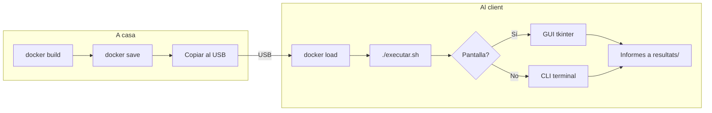

# Ús de l'Eina

## Mode Local (GUI)

```bash
cd /home/alumnat/Visual/coses
source entorn/bin/activate
python telegram_gui.py
```

La GUI tkinter ofereix pestanyes per a cada mòdul d'auditoria, permetent executar escaneigs, veure resultats i enviar informes via Telegram.

## Mode Docker (USB)

### Preparació (a casa)

```bash
docker build -t auditoria_pendrive .
docker save auditoria_pendrive -o docker_export/auditoria_pendrive.tar
```

### Execució (al client)

```bash
cd /media/.../docker_export
chmod +x executar.sh
./executar.sh
```

El script `executar.sh` detecta automàticament si hi ha pantalla disponible (GUI o mode terminal) i munta `telegram_config.json` si existeix.

### Comanda completa

```bash
docker run -it --rm --network host \
    -v $(pwd)/resultats:/app/dades \
    auditoria_pendrive
```

| Paràmetre | Funció |
|-----------|--------|
| `-it` | Mode interactiu |
| `--rm` | Esborra el contenidor en sortir |
| `--network host` | Utilitza la xarxa real del host |
| `-v $(pwd)/resultats:/app/dades` | Persistència dels informes |

## Flux USB



### Pas a pas

**Preparació:**

1. Construir la imatge: `docker build -t auditoria_pendrive .`
2. Exportar al USB: `docker save auditoria_pendrive -o /media/USB/auditoria_pendrive.tar`
3. Copiar la carpeta `docker_export/` al USB

**Execució:**

1. Carregar la imatge: `docker load -i auditoria_pendrive.tar`
2. Executar el llançador: `./executar.sh`
3. Desconnectar el USB — no queda cap rastre al sistema amfitrió
