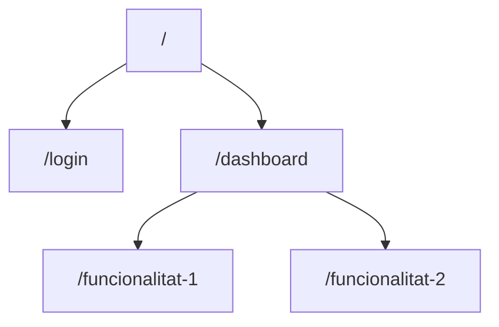

# Frontend

## Estructura del projecte

!!! info "Organització"
    Descriu l'estructura de directoris i fitxers del frontend.

```
frontend/
├── src/
│   ├── components/
│   ├── views/
│   ├── assets/
│   ├── router/
│   └── stores/
└── ...
```

<!-- TODO: Adapta l'estructura real del projecte -->

## Components principals

### Component 1
Descriu el component.

### Component 2
Descriu el component.

## Enrutament

Descriu el sistema de rutes del frontend.



## Gestió d'estat

Descriu com es gestiona l'estat de l'aplicació (Vuex, Pinia, Redux, etc.)

## Crides a l'API

Descriu com es fan les crides a l'API des del frontend.

## Estils

Descriu el sistema d'estils utilitzat (CSS, SCSS, Tailwind, etc.)
