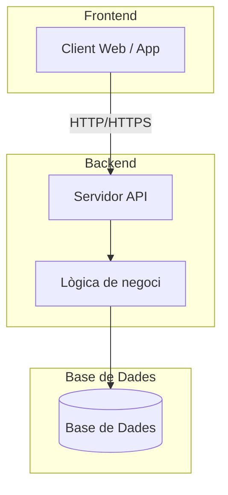

# Arquitectura del Sistema

## Visió general

!!! info "Arquitectura"
    Descriu aquí l'arquitectura general del sistema EbreSafe.

## Diagrama d'arquitectura

## Components principals

### Frontend
<!-- TODO: Descriu els components del frontend -->

### Backend
<!-- TODO: Descriu els components del backend -->

### Base de dades
<!-- TODO: Descriu el sistema de base de dades -->

## Patrons de disseny

Descriu els patrons de disseny utilitzats (MVC, API REST, etc.)

## Seguretat

!!! warning "Consideracions de seguretat"
    Descriu les mesures de seguretat implementades.
