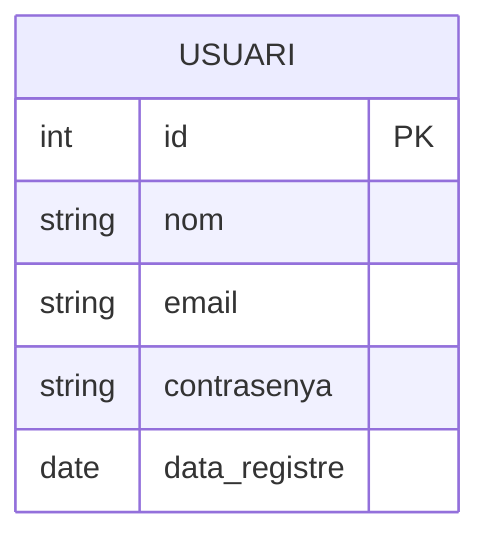

# Base de Dades

## Model de dades

!!! info "Sistema de gestió de base de dades"
    Indica aquí quin SGBD s'utilitza (MySQL, PostgreSQL, MongoDB, etc.)

## Diagrama Entitat-Relació



## Taules principals

### Taula: Usuaris

| Camp | Tipus | Descripció |
|------|-------|------------|
| id | INT | Clau primària |
| nom | VARCHAR(100) | Nom de l'usuari |
| email | VARCHAR(255) | Correu electrònic |
| contrasenya | VARCHAR(255) | Contrasenya encriptada |

<!-- TODO: Afegeix les taules reals -->

## Scripts de creació

```sql
-- TODO: Afegeix els scripts SQL de creació de la base de dades
CREATE DATABASE ebresafe;
```

## Dades de prova

Descriu les dades de prova utilitzades durant el desenvolupament.
