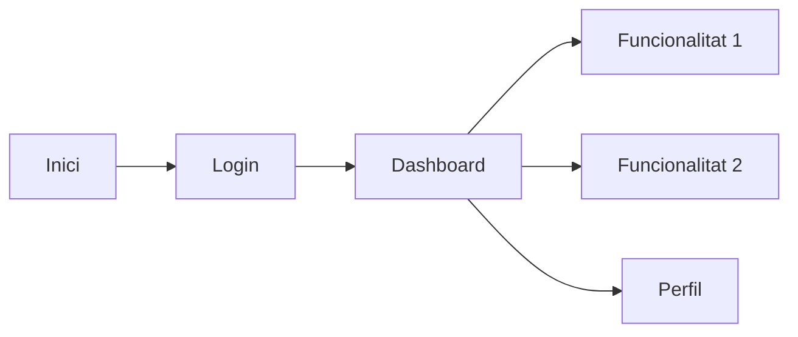

# Interfície d'Usuari

## Disseny visual

!!! info "Guia d'estil"
    Descriu aquí la guia d'estil visual del projecte.

## Paleta de colors

| Color | Codi | Ús |
|-------|------|-----|
| Primari | | Color principal |
| Secundari | | Color d'accent |
| Fons | | Color de fons |
| Text | | Color del text |

## Wireframes

<!-- TODO: Afegeix captures de pantalla o wireframes -->

### Pantalla principal

Descriu la pantalla principal de l'aplicació.

### Pantalla de registre/login

Descriu la pantalla d'autenticació.

## Navegació

## Disseny responsiu

Descriu com s'adapta la interfície a diferents dispositius.

## Accessibilitat

Descriu les consideracions d'accessibilitat implementades.
