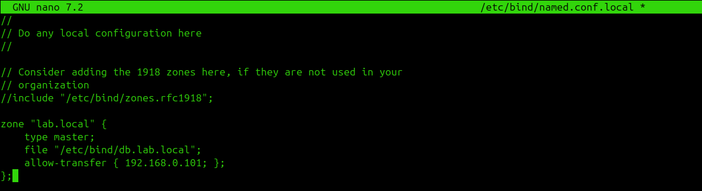
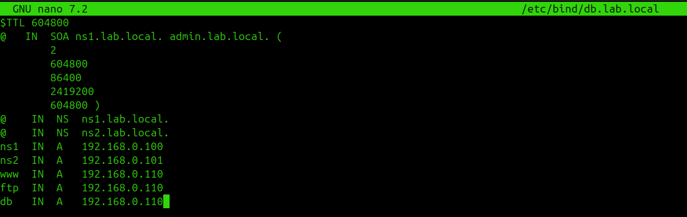
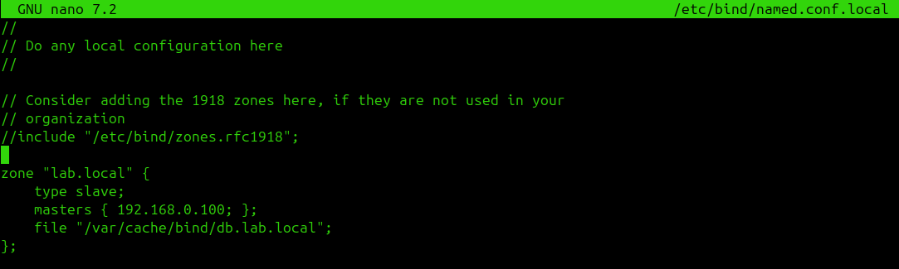
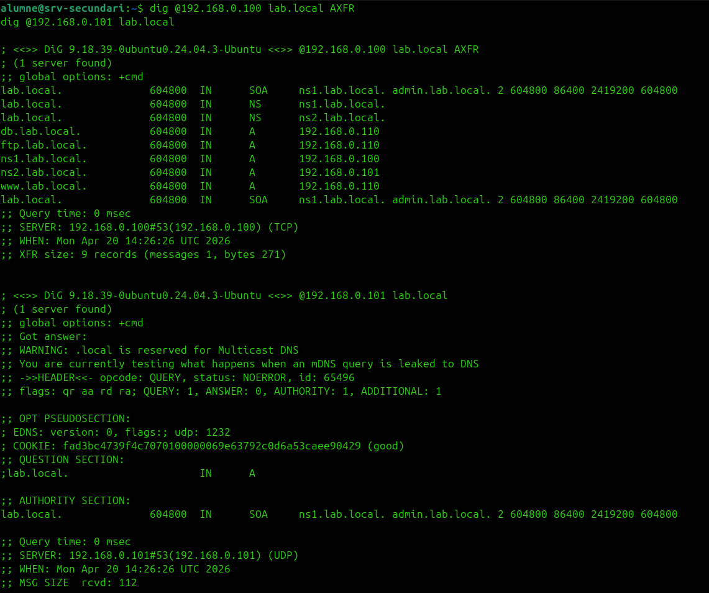
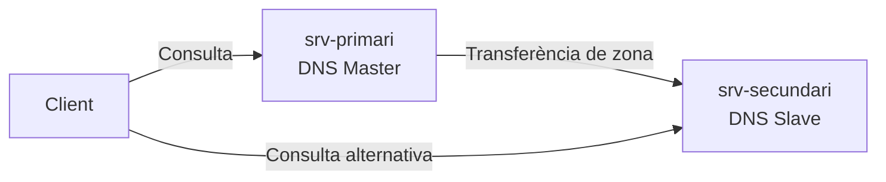

# HA de DNS

L'alta disponibilitat del DNS es basa en redundància **master/slave** entre els dos servidors.

## 1. Zona mestra al srv-primari

```bash
sudo nano /etc/bind/named.conf.local
```

```conf
zone "lab.local" {
    type master;
    file "/etc/bind/db.lab.local";
    allow-transfer { 192.168.0.101; };
};
```



Crear el fitxer de zona:

```bash
sudo cp /etc/bind/db.local /etc/bind/db.lab.local
sudo nano /etc/bind/db.lab.local
```

```dns
$TTL 604800
@   IN  SOA ns1.lab.local. admin.lab.local. (
        2
        604800
        86400
        2419200
        604800 )
@    IN  NS  ns1.lab.local.
@    IN  NS  ns2.lab.local.
ns1  IN  A   192.168.0.100
ns2  IN  A   192.168.0.101
www  IN  A   192.168.0.110
ftp  IN  A   192.168.0.110
db   IN  A   192.168.0.110
```



## 2. Zona esclava al srv-secundari

```bash
sudo nano /etc/bind/named.conf.local
```

```conf
zone "lab.local" {
    type slave;
    masters { 192.168.0.100; };
    file "/var/cache/bind/db.lab.local";
};
```



## 3. Reiniciar bind9

Als dos servidors:

```bash
sudo systemctl restart bind9
```

## 4. Verificació

```bash
dig @192.168.0.100 lab.local AXFR
dig @192.168.0.101 lab.local
```




