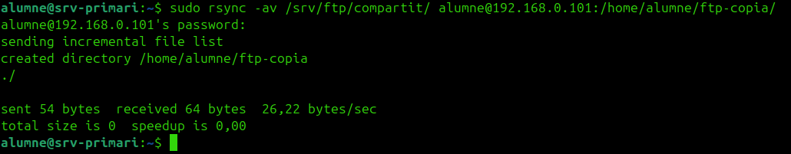
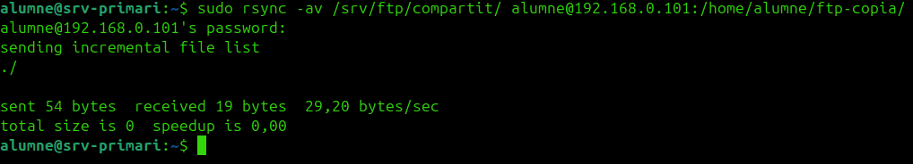
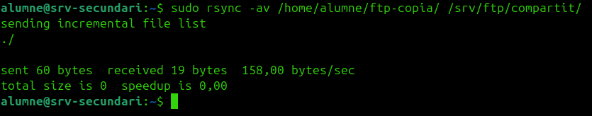

# HA de FTP

Per a `vsftpd`, la solució és **actiu-passiu**:

- `vsftpd` als dos nodes
- Mateix directori FTP
- Contingut sincronitzat
- Connexió per la `VIP`

## 1. Comprovar servei

Als dos servidors:

```bash
sudo systemctl status vsftpd
```

## 2. Sincronitzar directori FTP

Al `srv-primari`, si feu servir `/srv/ftp/compartit`:

```bash
sudo rsync -av /srv/ftp/compartit/ root@192.168.0.101:/srv/ftp/compartit/
```



## 3. Copiar configuració

```bash
sudo rsync -av /etc/vsftpd.conf root@192.168.0.101:/etc/vsftpd.conf
```





## 4. Reiniciar

Als dos servidors:

```bash
sudo systemctl restart vsftpd
```

## 5. Provar per la VIP

Des del PC:

```bash
ftp 192.168.0.110
```

## Què defensar

!!! success "Alta disponibilitat d'FTP"
    L'alta disponibilitat d'FTP es basa en:

    - Mateix servei als dos nodes
    - Mateixa configuració
    - Mateix contingut
    - `VIP` comuna
