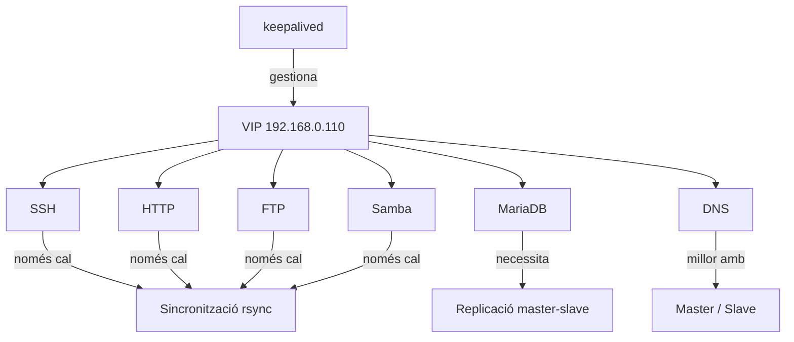

# Alta Disponibilitat dels Serveis

## Escenari

| Node | IP |
|------|----|
| `srv-primari` | `192.168.0.100` |
| `srv-secundari` | `192.168.0.101` |
| **VIP** | `192.168.0.110` |

Serveis instal·lats: `keepalived`, `SSH`, `Apache`, `MariaDB`, `bind9`, `vsftpd` i `Samba`.

## Concepte clau

`keepalived` gestiona una **IP virtual (VIP)**. Quan la VIP passa al secundari, tots els serveis que escolten en aquesta IP continuen disponibles automàticament.

- `HTTP`, `SSH`, `FTP` i `Samba` aprofiten directament la VIP
- `MariaDB` requereix, a més, **replicació de dades**
- `DNS` funciona amb esquema **master/slave**

## Estratègia d'HA per servei

| Servei | Tipus d'HA | Detalls |
|--------|-----------|---------|
| SSH | VIP + config sincronitzada | Actiu als dos nodes |
| HTTP | VIP + contingut sincronitzat | Configurat amb keepalived |
| MariaDB | VIP + replicació master-slave | Dades replicades entre nodes |
| DNS | Master / Slave | Zones transferides automàticament |
| FTP | VIP + rsync | Fitxers sincronitzats |
| Samba | VIP + rsync | Share sincronitzat |
