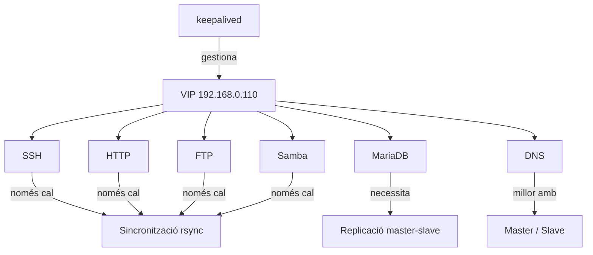

# Alta Disponibilitat dels Serveis

## Punt de partida

!!! info "Escenari"
    - `srv-primari`: `192.168.0.100`
    - `srv-secundari`: `192.168.0.101`
    - `VIP`: `192.168.0.110`

    Ja tenim: `keepalived` funcionant, `SSH`, `Apache`, `MariaDB`, `bind9`, `vsftpd` i `Samba` instal·lats.

## Com llegir aquesta secció

| Expressió | Significat |
|-----------|-----------|
| **Al srv-primari** | Executar-ho a `192.168.0.100` |
| **Al srv-secundari** | Executar-ho a `192.168.0.101` |
| **Als dos servidors** | Fer-ho als dos |
| **Des del teu PC** | Des de la màquina client, no dins de les VMs |

## Idea important

!!! tip "keepalived no és un servei d'Apache"
    `keepalived` gestiona una **IP virtual**. Per tant:

    - Si la `VIP` és `192.168.0.110`
    - I els serveis escolten en aquella IP
    - Quan la `VIP` passa al secundari, els serveis poden continuar disponibles

    Això vol dir:

    - `HTTP`, `SSH`, `FTP` i `Samba` poden aprofitar directament la mateixa `VIP`
    - `MariaDB` necessita, a més, **replicació de dades**
    - `DNS` es defensa millor com a **master/slave**

## Estratègia d'alta disponibilitat



## Resum tècnic

| Servei | Tipus d'HA | Detalls |
|--------|-----------|---------|
| SSH | VIP + config sincronitzada | Actiu als dos nodes |
| HTTP | VIP + contingut sincronitzat | Ja configurat amb keepalived |
| MariaDB | VIP + replicació master-slave | Dades replicades entre nodes |
| DNS | Master / Slave | Zones transferides automàticament |
| FTP | VIP + rsync | Fitxers sincronitzats |
| Samba | VIP + rsync | Share sincronitzat |

## Fase 1. Revisar keepalived

Com que ja està configurat, només cal verificar:

Als dos servidors:

```bash
ip a
systemctl status keepalived
```

**Prova de failover:**

Al primari:

```bash
sudo systemctl stop keepalived
```

Al secundari:

```bash
ip a
```

La `VIP` ha d'aparèixer al secundari. Després torna'l a posar:

```bash
sudo systemctl start keepalived
```

## Què presentar a classe

> Hem aprofitat una IP virtual gestionada per keepalived perquè diversos serveis continuïn disponibles després d'un failover. A més, per als serveis amb estat o dades, hem afegit sincronització o replicació entre nodes.
