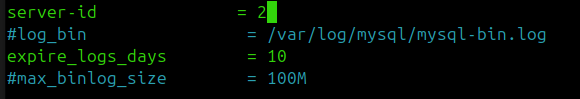
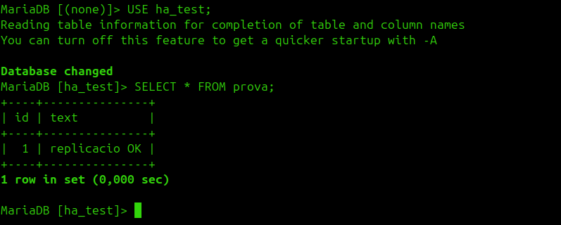
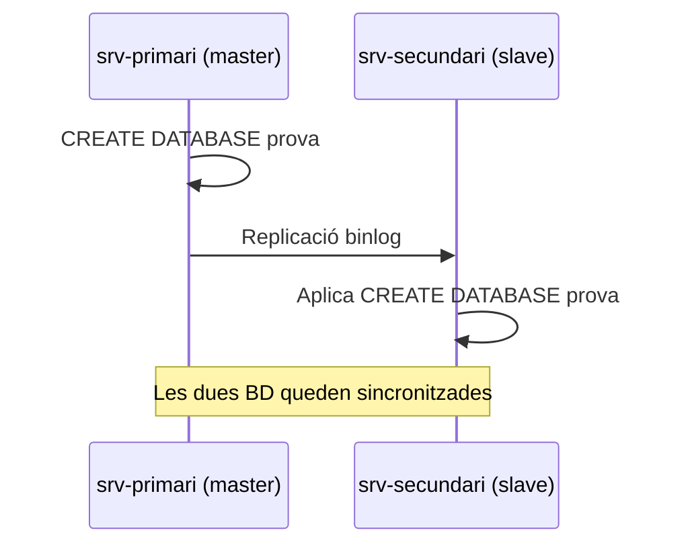

# HA de MariaDB

MariaDB requereix **replicació de dades** entre nodes, no només la VIP.

## 1. Configurar el srv-primari

```bash
sudo nano /etc/mysql/mariadb.conf.d/50-server.cnf
```

```conf
bind-address = 0.0.0.0
server-id = 1
log_bin = /var/log/mysql/mysql-bin.log
```


```bash
sudo systemctl restart mariadb
```

## 2. Crear usuari de replicació

Al `srv-primari`:

```bash
sudo mysql
```

```sql
CREATE USER 'replica'@'192.168.0.101' IDENTIFIED BY 'replica123';
GRANT REPLICATION SLAVE ON *.* TO 'replica'@'192.168.0.101';
FLUSH PRIVILEGES;
SHOW MASTER STATUS;
```


Apuntar els valors de `File` i `Position` que retorna `SHOW MASTER STATUS` per al pas 4.

## 3. Configurar el srv-secundari

```bash
sudo nano /etc/mysql/mariadb.conf.d/50-server.cnf
```

```conf
bind-address = 0.0.0.0
server-id = 2
```



```bash
sudo systemctl restart mariadb
```

## 4. Activar la rèplica al secundari

```bash
sudo mysql
```

```sql
STOP SLAVE;
CHANGE MASTER TO
  MASTER_HOST='192.168.0.100',
  MASTER_USER='replica',
  MASTER_PASSWORD='replica123',
  MASTER_LOG_FILE='mysql-bin.000001',
  MASTER_LOG_POS=TU_POSICIO;
START SLAVE;
SHOW SLAVE STATUS\G
```

Ha de sortir `Slave_IO_Running: Yes` i `Slave_SQL_Running: Yes`.


## 5. Comprovació

Creació d'una base de dades de prova al primari:


Apareix automàticament al secundari:




