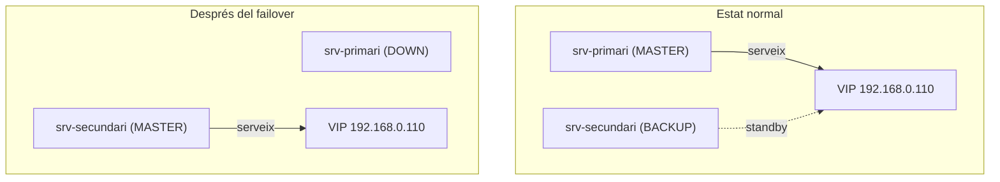

# Prova Final de Tots els Serveis

## Comprovació amb el primari actiu

Des del PC, comprova tots els serveis:

```bash
ssh alumne@192.168.0.110
curl http://192.168.0.110
ftp 192.168.0.110
smbclient -N //192.168.0.110/public -c "ls"
mysql -h 192.168.0.110 -u root -p
dig @192.168.0.110 lab.local
```

## Simulació de caiguda

Al `srv-primari`:

```bash
sudo systemctl stop keepalived
```

## Repetir les proves

!!! success "Resultat esperat"
    Tots els serveis haurien de continuar responent a través de la `VIP`, ara servits pel `srv-secundari`.

```bash
ssh alumne@192.168.0.110
curl http://192.168.0.110
ftp 192.168.0.110
smbclient -N //192.168.0.110/public -c "ls"
mysql -h 192.168.0.110 -u root -p
dig @192.168.0.110 lab.local
```

## Resum mínim defensable

!!! tip "Mínim recomanat"
    1. `keepalived` amb `VIP` funcional
    2. `SSH` i `HTTP` responent per la `VIP`
    3. `FTP` i `Samba` sincronitzats amb `rsync`
    4. `DNS` amb `master/slave`
    5. `MariaDB` amb rèplica simple

    Amb això queda molt millor explicat i no sembla que `keepalived` sigui només "la part del web".

## Diagrama de la prova


