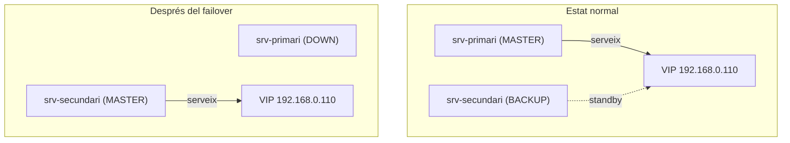

# Prova Final de Tots els Serveis

## Comprovació amb el primari actiu

Des del PC, verificar tots els serveis a través de la VIP:

```bash
ssh alumne@192.168.0.110
curl http://192.168.0.110
ftp 192.168.0.110
smbclient -N //192.168.0.110/public -c "ls"
mysql -h 192.168.0.110 -u root -p
dig @192.168.0.110 lab.local
```

## Simulació de caiguda

Al `srv-primari`:

```bash
sudo systemctl stop keepalived
```

## Verificació del failover

Un cop aturat el primari, repetir les mateixes proves. Tots els serveis han de continuar responent a través de la VIP, ara servits pel `srv-secundari`.

```bash
ssh alumne@192.168.0.110
curl http://192.168.0.110
ftp 192.168.0.110
smbclient -N //192.168.0.110/public -c "ls"
mysql -h 192.168.0.110 -u root -p
dig @192.168.0.110 lab.local
```

## Diagrama del failover


