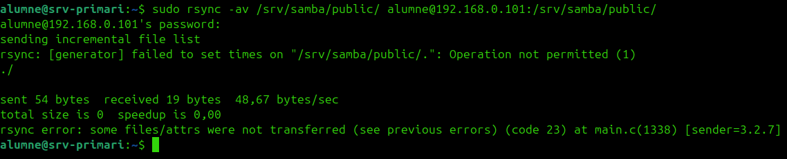
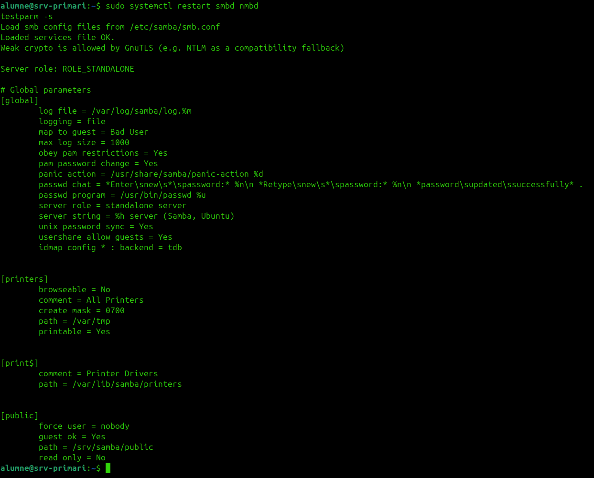

# HA de Samba

Samba també es configura en **actiu-passiu**:

- Mateix share
- Mateix camí
- Mateixa configuració
- Dades sincronitzades
- Accés per la `VIP`

## 1. Comprovar servei

Als dos servidors:

```bash
sudo systemctl status smbd
```

## 2. Sincronitzar directori del share

Al `srv-primari`, si el share és `/srv/samba/public`:

```bash
sudo rsync -av /srv/samba/public/ alumne@192.168.0.101:/srv/samba/public/
```



## 3. Copiar configuració

```bash
sudo rsync -av /etc/samba/smb.conf alumne@192.168.0.101:/etc/samba/smb.conf
```


## 4. Reiniciar

Als dos servidors:

```bash
sudo systemctl restart smbd nmbd
```

## 5. Provar per la VIP

Des del PC:

```bash
smbclient -N //192.168.0.110/public -c "ls"
```



