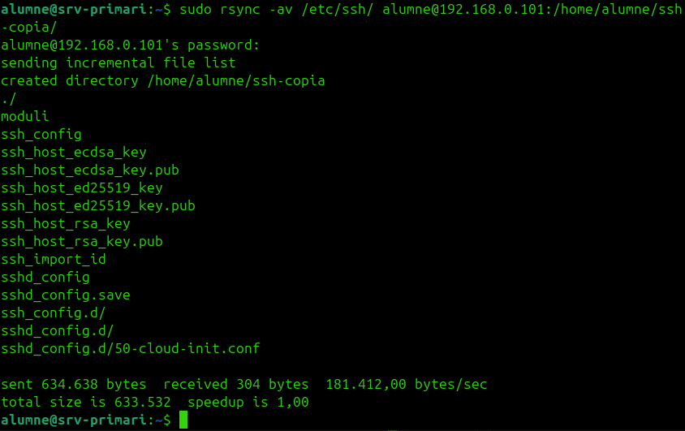
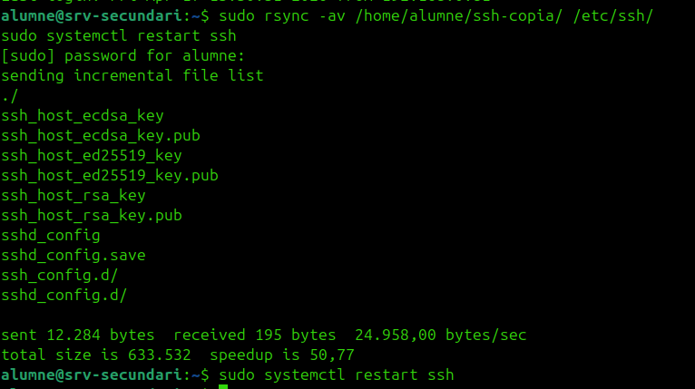
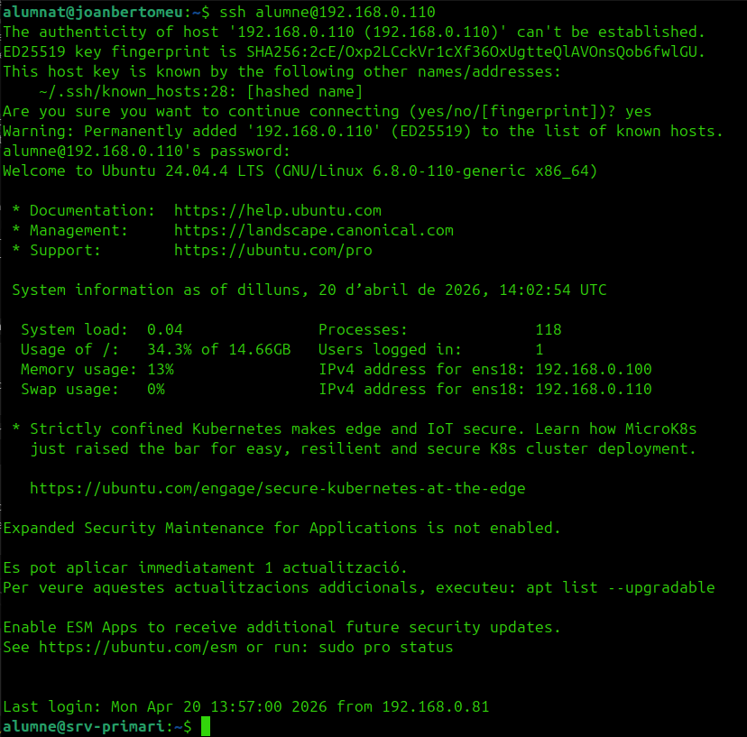

# HA de SSH

L'alta disponibilitat d'SSH és d'**accés**: `sshd` actiu als dos nodes amb configuració semblant, connexió sempre a la VIP.

## 1. Verificar SSH actiu

Als dos servidors:

```bash
sudo systemctl status ssh
```

## 2. Sincronitzar configuració

Al `srv-primari`:

```bash
sudo rsync -av /etc/ssh/ root@192.168.0.101:/etc/ssh/
```



## 3. Reiniciar als dos servidors

```bash
sudo systemctl restart ssh
```



## 4. Provar per la VIP

```bash
ssh alumne@192.168.0.110
```



## 5. Comprovar failover

Aturant el primari, el secundari agafa la VIP i la connexió SSH continua funcionant:


Si els dos servidors tenen claus host diferents, durant el failover pot sortir un avís de canvi d'identitat SSH. Això és normal i no indica cap error.
