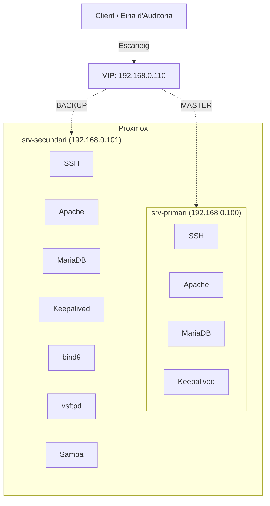

# :shield: EbreSafe — Projecte Intermodular

Documentació del **Projecte Intermodular EbreSafe**.

---

## Què és EbreSafe?

EbreSafe és una **eina multi-protocol d'auditoria de seguretat de xarxa** amb interfície GUI (tkinter) i mode CLI per a Docker. El projecte inclou un **laboratori amb alta disponibilitat** sobre Proxmox per simular entorns reals d'auditoria.

## Continguts

- :material-presentation: **Presentació**

    ---

    Descripció general, objectius, equip de treball i enllaços.

    [:octicons-arrow-right-24: Veure presentació](presentacio/descripcio.md)

- :material-server-network: **Laboratori**

    ---

    Muntatge del laboratori amb dos servidors Ubuntu, serveis vulnerables i alta disponibilitat.

    [:octicons-arrow-right-24: Veure laboratori](laboratori/proxmox.md)

- :material-shield-check: **Alta Disponibilitat**

    ---

    Configuració d'HA per a SSH, HTTP, MariaDB, DNS, FTP i Samba amb keepalived.

    [:octicons-arrow-right-24: Veure HA](ha/index.md)

- :material-shield-bug: **Correcció de Vulnerabilitats**

    ---

    Revisió dels resultats de l'auditoria i aplicació de correccions per mitigar les vulnerabilitats detectades.

    [:octicons-arrow-right-24: Veure correccions](laboratori/arreglar_vulnerabilitats.md)

- :material-bug: **Eina d'Auditoria**

    ---

    Escaneig de ports, SSH, SMB, OSINT i Telegram.

    [:octicons-arrow-right-24: Veure eina](auditoria/descripcio.md)

---

## Escenari

## Enllaços ràpids

| Recurs | Enllaç |
|--------|--------|
| :material-presentation-play: Presentació Canva | [canva.link/j1zessxf4730u5n](https://canva.link/j1zessxf4730u5n) |
| :material-web: Documentació GitHub Pages | [jordicerv.github.io/projecte_ebresafe](https://jordicerv.github.io/projecte_ebresafe/) |
| :material-github: Repositori GitHub | [github.com/jordicerv/projecte_ebresafe](https://github.com/jordicerv/projecte_ebresafe) |
| :material-trello: KanbanFlow | [kanbanflow.com/board/eHnakJ4](https://kanbanflow.com/board/eHnakJ4) |
