# Revisió i Correcció de Vulnerabilitats

## 1. Introducció

S'ha executat una eina d'auditoria pròpia sobre el servidor (`192.168.0.101`) per detectar vulnerabilitats en els serveis exposats. L'eina analitza els ports oberts, identifica CVEs conegudes associades a les versions dels serveis, i reporta problemes de configuració que podrien comprometre la seguretat del sistema.

A continuació es documenten els resultats obtinguts i les accions correctives aplicades per mitigar les vulnerabilitats més crítiques.

---

## 2. Resultats de l'auditoria

### 2.1. Vulnerabilitats al port 22 (SSH) i port 3306 (MySQL)

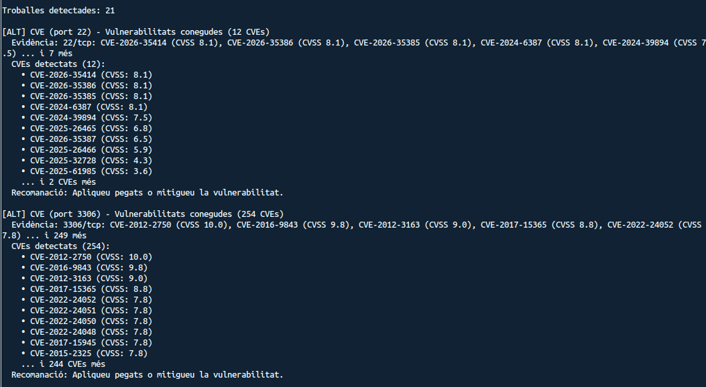

L'eina ha detectat un total de **21 troballes**. En primer lloc, al **port 22 (SSH)** s'han identificat **12 CVEs** associades a la versió d'OpenSSH instal·lada, amb puntuacions CVSS que van des de 3.6 fins a 8.1. Les més crítiques inclouen CVE-2026-35414, CVE-2026-35386, CVE-2026-35385 i CVE-2024-6387, totes amb CVSS 8.1.

Al **port 3306 (MySQL/MariaDB)** s'han trobat **254 CVEs**, algunes amb la puntuació màxima de CVSS 10.0 (CVE-2012-2750) i altres molt crítiques com CVE-2016-9843 (CVSS 9.8) i CVE-2012-3163 (CVSS 9.0). Aquestes vulnerabilitats estan relacionades amb la versió del motor de base de dades.

### 2.2. Vulnerabilitats al port 80 (HTTP) i port 139 (NetBIOS/SMB)

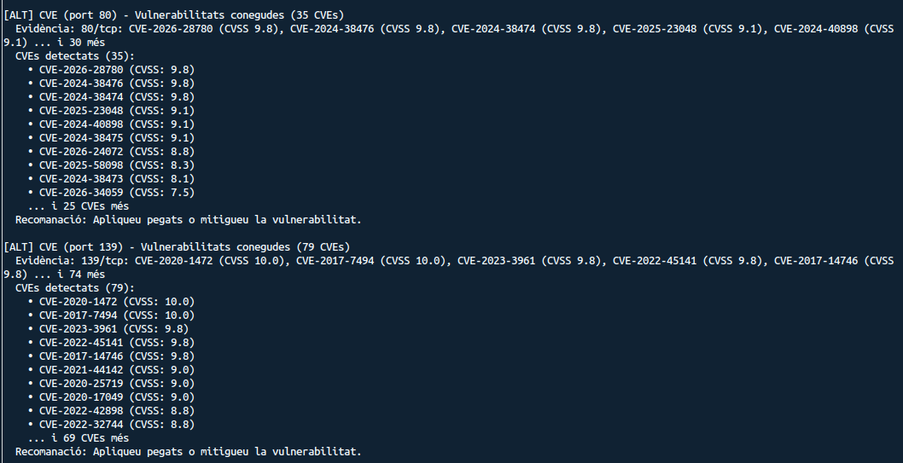

Al **port 80 (HTTP/Apache)** s'han detectat **35 CVEs** amb puntuacions molt elevades. Destaquen CVE-2026-28780 i CVE-2024-38476 (CVSS 9.8), i CVE-2025-23048 i CVE-2024-40898 (CVSS 9.1). Aquestes vulnerabilitats corresponen a la versió d'Apache instal·lada al servidor.

Al **port 139 (NetBIOS/SMB)** s'han identificat **79 CVEs**, incloent CVE-2020-1472 i CVE-2017-7494 amb la puntuació màxima de CVSS 10.0. Són vulnerabilitats associades a la versió del servei Samba.

### 2.3. Vulnerabilitats al port 445 (SMB) i problemes de configuració HTTP/SMB

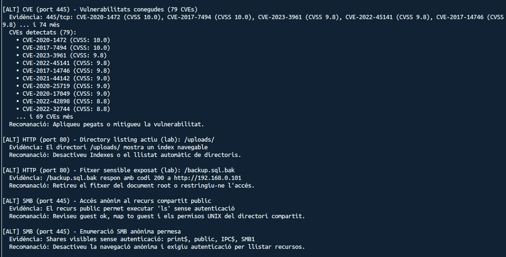

Al **port 445 (SMB)** es repeteixen les mateixes **79 CVEs** que al port 139, ja que ambdós ports donen servei al protocol SMB amb la mateixa versió de Samba.

A més de les CVEs, l'eina ha detectat diversos **problemes de configuració**:

- **Directory listing actiu a `/uploads/`**: El directori `/uploads/` del servidor web mostra un índex navegable, cosa que permet a qualsevol atacant llistar i descarregar els fitxers que hi ha.
- **Fitxer sensible exposat (`/backup.sql.bak`)**: S'ha trobat un fitxer de còpia de seguretat de la base de dades accessible públicament, que respon amb codi 200 a `http://192.168.0.101/backup.sql.bak`.
- **Accés anònim al recurs compartit `public` (SMB)**: El recurs compartit permet executar comandes com `ls` sense autenticació.
- **Enumeració SMB anònima permesa**: Es poden llistar els recursos compartits (`print$`, `public`, `IPC$`, `SMB1`) sense necessitat d'autenticar-se.

### 2.4. Vulnerabilitats de criticitat mitjana

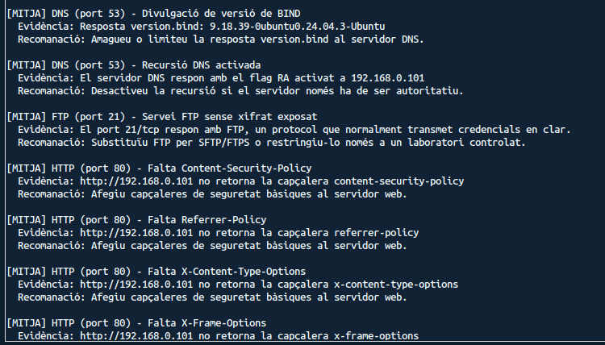

L'eina també ha identificat vulnerabilitats de **criticitat mitjana [MITJA]**:

- **Divulgació de versió de BIND (port 53)**: El servidor DNS respon amb la versió exacta del programari (`9.18.39-0ubuntu0.24.04.3-Ubuntu`), cosa que facilita la cerca de CVEs específiques per part d'un atacant.
- **Recursió DNS activada**: El servidor DNS respon amb el flag RA activat, permetent que sigui utilitzat per a atacs de recursió.
- **Servei FTP sense xifrat (port 21)**: El servei FTP transmet credencials en clar, cosa que el fa vulnerable a atacs de tipus man-in-the-middle.
- **Falta de capçaleres de seguretat HTTP (port 80)**: No es retornen les capçaleres `Content-Security-Policy`, `Referrer-Policy`, `X-Content-Type-Options` ni `X-Frame-Options`, que protegeixen contra atacs XSS, clickjacking i injecció de contingut.

---

## 3. Correccions aplicades

### 3.1. Actualització del sistema i dels serveis (SSH)

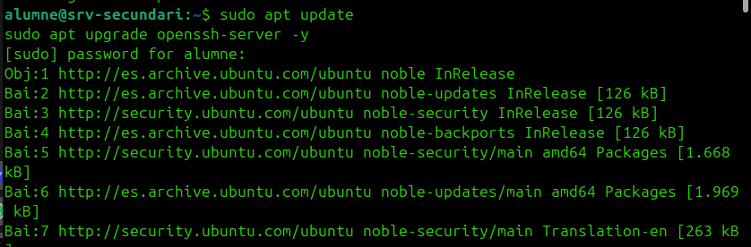

Per corregir les vulnerabilitats més crítiques del servei SSH, s'ha procedit a **actualitzar el sistema operatiu i el paquet OpenSSH** mitjançant les comandes:

```bash
sudo apt update
sudo apt upgrade openssh-server -y
```

Amb aquesta actualització s'apliquen els pegats de seguretat disponibles per a la versió d'OpenSSH, mitigant les CVEs reportades amb CVSS 8.1.

Cal destacar que **no s'ha modificat cap paràmetre de la configuració de SSH** (com ara el fitxer `sshd_config`). S'ha pres la decisió de no endurir la configuració d'aquest servei per precaució, ja que ens feia por perdre la connectivitat remota i no poder tornar a connectar-nos al servidor.

### 3.2. Restricció del port de MySQL (bind-address)

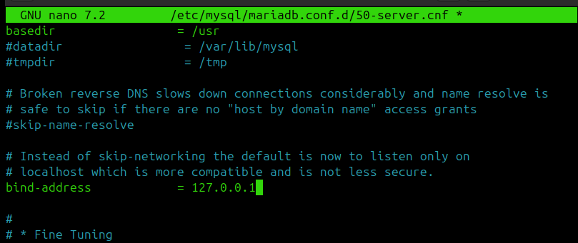

Per mitigar les **254 CVEs** associades al port 3306, s'ha configurat MariaDB perquè **només escolti connexions locals**. S'ha editat el fitxer `/etc/mysql/mariadb.conf.d/50-server.cnf` i s'ha establert:

```
bind-address = 127.0.0.1
```

D'aquesta manera, el port 3306 deixa d'estar exposat a la xarxa, i les vulnerabilitats associades deixen de ser explotables remotament.

### 3.3. Desactivació del directory listing a Apache

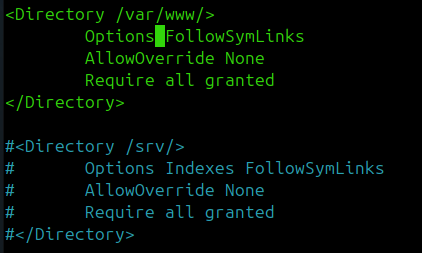

Per resoldre el problema del **directory listing actiu a `/uploads/`**, s'ha modificat la configuració d'Apache al bloc `<Directory /var/www/>`. S'ha eliminat l'opció `Indexes` de la directiva `Options`, deixant només `FollowSymLinks`:

```apache
<Directory /var/www/>
    Options FollowSymLinks
    AllowOverride None
    Require all granted
</Directory>
```

Això impedeix que Apache mostri el llistat de fitxers dels directoris que no tenen un fitxer `index.html` o `index.php`.

### 3.4. Eliminació del fitxer de backup exposat

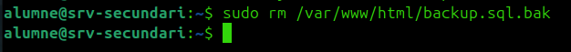

S'ha eliminat el fitxer de còpia de seguretat que estava exposat públicament al document root del servidor web:

```bash
sudo rm /var/www/html/backup.sql.bak
```

D'aquesta manera, el fitxer ja no és accessible des del navegador i s'evita la filtració de dades sensibles de la base de dades.

### 3.5. Afegir capçaleres de seguretat HTTP a Apache

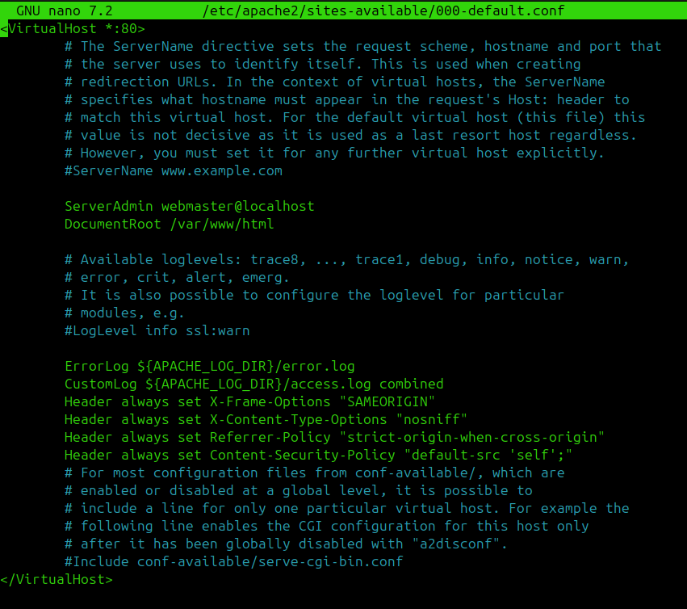

Per resoldre la manca de capçaleres de seguretat HTTP, s'ha editat el fitxer de configuració del VirtualHost d'Apache (`/etc/apache2/sites-available/000-default.conf`) i s'hi han afegit les línies següents:

```apache
Header always set X-Frame-Options "SAMEORIGIN"
Header always set X-Content-Type-Options "nosniff"
Header always set Referrer-Policy "strict-origin-when-cross-origin"
Header always set Content-Security-Policy "default-src 'self';"
```

Aquestes capçaleres protegeixen contra:

- **Clickjacking** (`X-Frame-Options`): impedeix que la pàgina sigui carregada dins d'un iframe extern.
- **MIME-type sniffing** (`X-Content-Type-Options`): evita que el navegador interpreti fitxers amb un tipus MIME incorrecte.
- **Filtració de referrer** (`Referrer-Policy`): controla quina informació s'envia a la capçalera Referer.
- **Injecció de contingut i XSS** (`Content-Security-Policy`): restringeix les fonts de contingut permeses.

### 3.6. Ocultació de la versió d'Apache

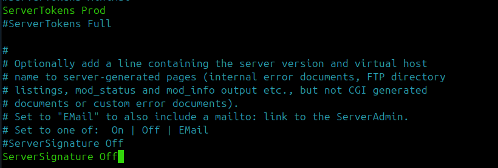

S'ha modificat la configuració global d'Apache per **ocultar la versió del servidor** en les respostes HTTP i les pàgines d'error. S'han establert els paràmetres:

```apache
ServerTokens Prod
ServerSignature Off
```

Amb `ServerTokens Prod`, Apache només informa que el servidor és "Apache" sense revelar la versió ni els mòduls instal·lats. Amb `ServerSignature Off`, es desactiva la signatura que apareix a les pàgines d'error generades pel servidor.

### 3.7. Securització del servei SMB (Samba)

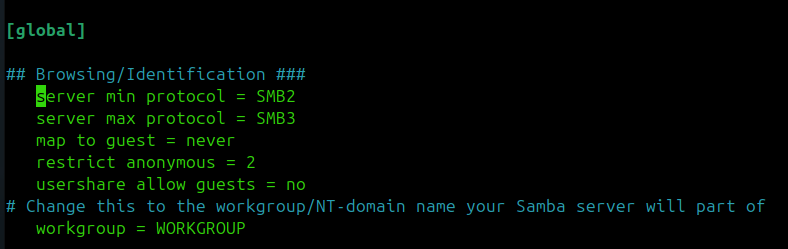

Per corregir les vulnerabilitats d'**accés anònim i enumeració SMB**, s'ha modificat el fitxer de configuració de Samba (`/etc/samba/smb.conf`). A la secció `[global]` s'han aplicat els canvis següents:

```ini
[global]
server min protocol = SMB2
server max protocol = SMB3
map to guest = never
restrict anonymous = 2
usershare allow guests = no
```

- **`server min protocol = SMB2`**: Desactiva SMB1, un protocol antic amb vulnerabilitats conegudes (com EternalBlue).
- **`server max protocol = SMB3`**: Limita el protocol màxim a SMB3 per garantir connexions xifrades.
- **`map to guest = never`**: Impedeix que les connexions fallides es mapejin automàticament a l'usuari guest.
- **`restrict anonymous = 2`**: Bloqueja completament l'accés anònim, impedint l'enumeració de recursos.
- **`usershare allow guests = no`**: Desactiva l'accés de convidats als recursos compartits.

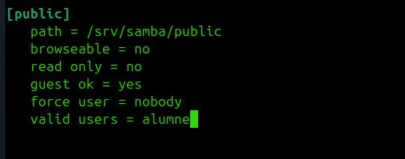

Addicionalment, s'ha modificat la configuració del recurs compartit `[public]` per restringir-ne l'accés:

```ini
[public]
path = /srv/samba/public
browseable = no
read only = no
guest ok = yes
force user = nobody
valid users = alumne
```

S'ha establert **`browseable = no`** perquè el recurs no sigui visible en les enumeracions, i **`valid users = alumne`** per restringir l'accés només a l'usuari autoritzat.

---

## 4. Vulnerabilitats no corregides

També s'han identificat altres vulnerabilitats dins del servidor, però són de **criticitat baixa** i tenen un **impacte limitat** sobre el projecte. Algunes d'elles inclouen:

- Divulgació de la versió de BIND al servidor DNS.
- Recursió DNS activada.
- Servei FTP sense xifrat exposat.

Per aquest motiu, s'ha decidit **no prioritzar-ne la correcció en aquesta fase**, ja que la seva resolució és complexa i no aporta una millora rellevant en el context actual del projecte. Es recomana revisar-les en futures iteracions del procés de bastionament.
