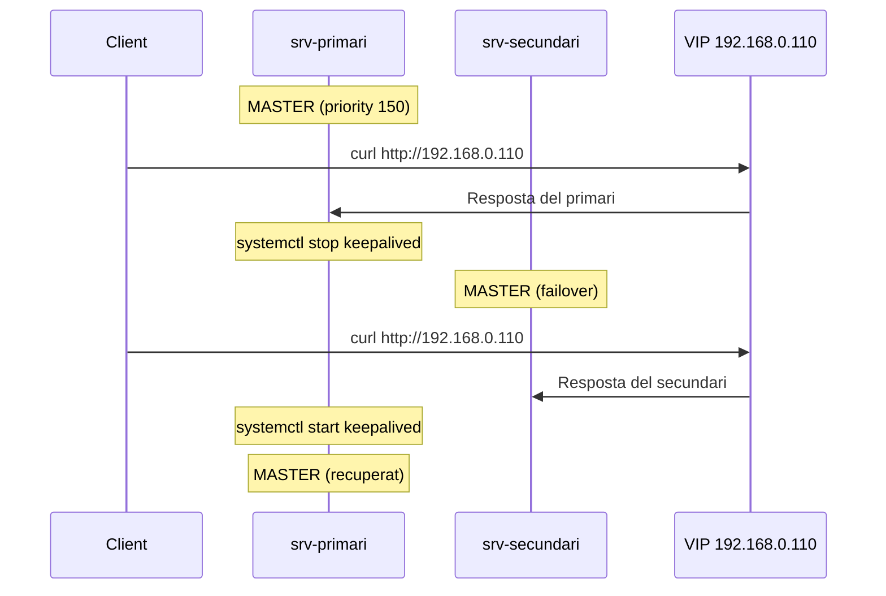

# Keepalived i Failover

Aquesta és la part clau de la pràctica d'alta disponibilitat.

## Comprovar la interfície de xarxa

Als dos servidors:

```bash
ip a
```

Apunta el nom de la interfície. En molts casos serà `ens18` o `eth0`.

!!! note "Nota"
    En els exemples d'aquesta guia es fa servir `ens18`. Si la teva és una altra, canvia-la.

## Configuració del primari

```bash
sudo nano /etc/keepalived/keepalived.conf
```

```conf
global_defs {
    enable_script_security
}

vrrp_script chk_apache {
    script "/usr/bin/pgrep apache2"
    interval 2
    weight -60
}

vrrp_instance VI_1 {
    state MASTER
    interface ens18
    virtual_router_id 51
    priority 150
    advert_int 1
    authentication {
        auth_type PASS
        auth_pass asixha
    }
    track_script {
        chk_apache
    }
    virtual_ipaddress {
        192.168.0.110/24
    }
}
```

## Configuració del secundari

```bash
sudo nano /etc/keepalived/keepalived.conf
```

```conf
global_defs {
    enable_script_security
}

vrrp_script chk_apache {
    script "/usr/bin/pgrep apache2"
    interval 2
    weight -60
}

vrrp_instance VI_1 {
    state BACKUP
    interface ens18
    virtual_router_id 51
    priority 100
    advert_int 1
    authentication {
        auth_type PASS
        auth_pass asixha
    }
    track_script {
        chk_apache
    }
    virtual_ipaddress {
        192.168.0.110/24
    }
}
```

!!! info "Diferències clau"
    - **Primari:** `state MASTER`, `priority 150`
    - **Secundari:** `state BACKUP`, `priority 100`

## Reiniciar el servei

Als dos nodes:

```bash
sudo systemctl enable keepalived
sudo systemctl restart keepalived
sudo systemctl status keepalived
```

## Comprovació de la IP virtual

Primer comprova al primari:

```bash
ip a | grep 192.168.0.110
```

Ha d'aparèixer la IP virtual al `srv-primari`.

Després prova l'accés:

```bash
curl http://192.168.0.110
```


## Prova de failover

!!! success "Test important"
    Aquest és el test que donarà més joc a la presentació.

### 1. Amb el primari actiu

```bash
curl http://192.168.0.110
```

Hauries de veure la pàgina del `srv-primari`.

### 2. Simular caiguda del primari

Atura `keepalived` al primari:

```bash
sudo systemctl stop keepalived
```

O bé atura Apache:

```bash
sudo systemctl stop apache2
```

### 3. Comprovar el secundari

Al `srv-secundari`:

```bash
ip a | grep 192.168.0.110
```

Ara la IP virtual hauria d'haver passat al segon node.

Des d'una altra màquina:

```bash
curl http://192.168.0.110
```

Hauries de veure la pàgina del `srv-secundari`.


### 4. Recuperar el primari

```bash
sudo systemctl start apache2
sudo systemctl start keepalived
```


