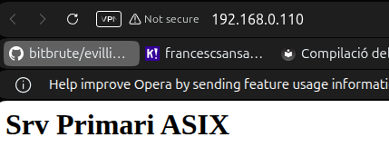
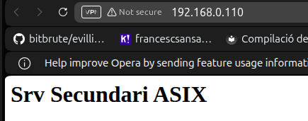
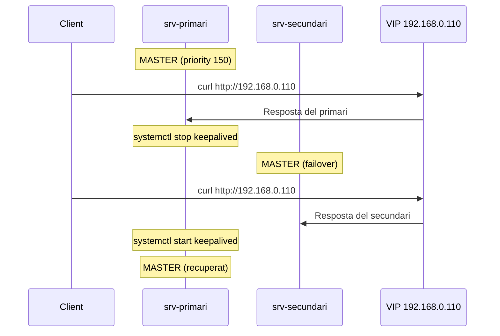

# Keepalived i Failover

## Interfície de xarxa

Als dos servidors, comprovar el nom de la interfície (normalment `ens18` o `eth0`):

```bash
ip a
```

## Configuració del primari

```bash
sudo nano /etc/keepalived/keepalived.conf
```

```conf
global_defs {
    enable_script_security
}

vrrp_script chk_apache {
    script "/usr/bin/pgrep apache2"
    interval 2
    weight -60
}

vrrp_instance VI_1 {
    state MASTER
    interface ens18
    virtual_router_id 51
    priority 150
    advert_int 1
    authentication {
        auth_type PASS
        auth_pass asixha
    }
    track_script {
        chk_apache
    }
    virtual_ipaddress {
        192.168.0.110/24
    }
}
```

## Configuració del secundari

```bash
sudo nano /etc/keepalived/keepalived.conf
```

```conf
global_defs {
    enable_script_security
}

vrrp_script chk_apache {
    script "/usr/bin/pgrep apache2"
    interval 2
    weight -60
}

vrrp_instance VI_1 {
    state BACKUP
    interface ens18
    virtual_router_id 51
    priority 100
    advert_int 1
    authentication {
        auth_type PASS
        auth_pass asixha
    }
    track_script {
        chk_apache
    }
    virtual_ipaddress {
        192.168.0.110/24
    }
}
```

**Diferències clau:** el primari té `state MASTER` i `priority 150`, el secundari `state BACKUP` i `priority 100`.

## Activar el servei

Als dos nodes:

```bash
sudo systemctl enable keepalived
sudo systemctl restart keepalived
sudo systemctl status keepalived
```

## Comprovació de la VIP

Al primari:

```bash
ip a | grep 192.168.0.110
```

```bash
curl http://192.168.0.110
```



## Prova de failover

### 1. Amb el primari actiu

```bash
curl http://192.168.0.110
```

### 2. Simular caiguda

```bash
sudo systemctl stop keepalived
```

O bé:

```bash
sudo systemctl stop apache2
```

### 3. Comprovar el secundari

```bash
ip a | grep 192.168.0.110
```

```bash
curl http://192.168.0.110
```



### 4. Recuperar el primari

```bash
sudo systemctl start apache2
sudo systemctl start keepalived
```

### Diagrama del failover


