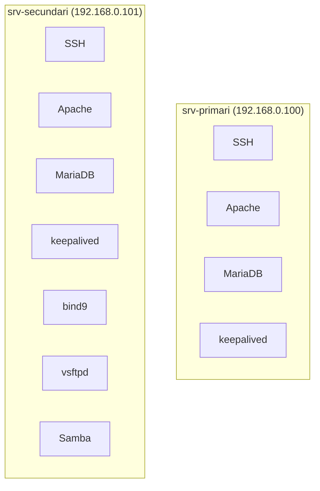

# Muntatge del Laboratori

## Objectiu

Muntar un entorn amb dos servidors Ubuntu, alta disponibilitat bàsica i serveis vulnerables per a l'eina d'auditoria.

## Escenari

| Rol | IP | Descripció |
|-----|-----|-----------|
| `srv-primari` | `192.168.0.100` | Servidor principal |
| `srv-secundari` | `192.168.0.101` | Servidor de backup |
| **VIP** | `192.168.0.110` | IP virtual (keepalived) |

## Distribució de serveis



- Als dos servidors: `SSH`, `Apache`, `MariaDB`, `keepalived`
- Al `srv-secundari`, a més: `bind9`, `vsftpd`, `Samba`

## Preparació del primari

Comprovació i actualització:

```bash
ip a
hostnamectl
sudo apt update && sudo apt upgrade -y
sudo hostnamectl set-hostname srv-primari
```

Snapshot a Proxmox amb nom `ubuntu-base-neta` un cop el sistema estigui net.
