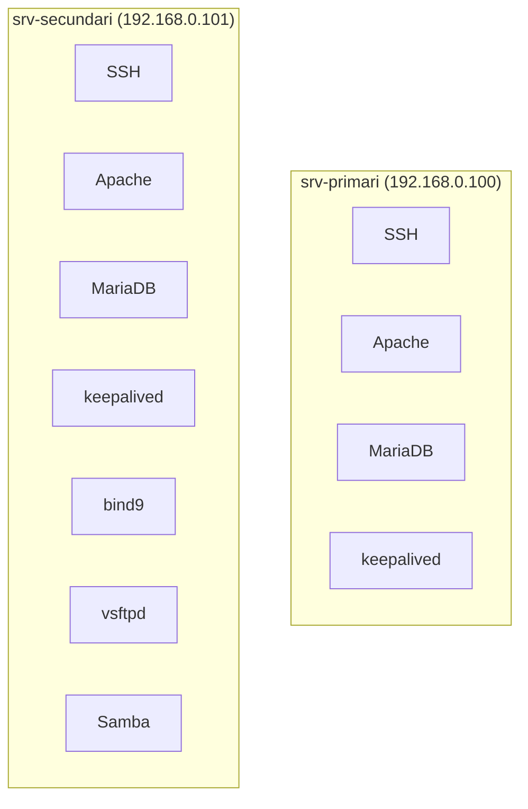

# Muntatge del Laboratori

Guia pràctica per muntar el laboratori dins de Proxmox per al projecte intermodular.

## Objectiu

!!! info "Què volem aconseguir"
    - Dos servidors Ubuntu
    - Alta disponibilitat bàsica entre tots dos
    - Serveis vulnerables perquè l'eina d'auditoria tingui coses útils a detectar

## Escenari recomanat

| Rol | IP | Descripció |
|-----|-----|-----------|
| `srv-primari` | `192.168.0.100` | Servidor principal |
| `srv-secundari` | `192.168.0.101` | Servidor de backup |
| **VIP** | `192.168.0.110` | IP virtual (keepalived) |

La IP virtual serà la que mourà `keepalived` entre els dos servidors quan caigui el node principal.

## Distribució de serveis



!!! tip "Idea general"
    - Als dos servidors: `SSH`, `Apache`, `MariaDB`, `keepalived`
    - Al `srv-secundari`, a més: `bind9`, `vsftpd`, `Samba`

    Amb això es pot defensar:

    - Alta disponibilitat del servei web amb IP virtual
    - Redundància bàsica entre dos nodes
    - Un conjunt de serveis vulnerables suficient per a l'auditoria

## Preparació del primari

### 1. Comprovar l'estat actual

Al `srv-primari`:

```bash
ip a
hostnamectl
sudo apt update && sudo apt upgrade -y
```

Si encara no s'ha fet:

```bash
sudo hostnamectl set-hostname srv-primari
```

### 2. Crear snapshot

!!! warning "Important"
    Quan el sistema estigui net i actualitzat, fes un snapshot a Proxmox.

Nom recomanat:

```text
ubuntu-base-neta
```
