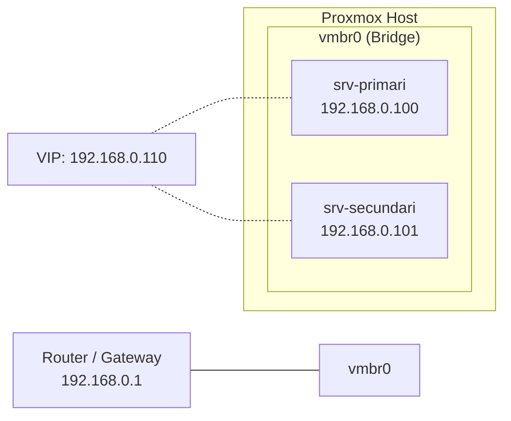

# Entorn Proxmox

## Què és Proxmox VE?

!!! info "Proxmox Virtual Environment"
    [Proxmox VE](https://www.proxmox.com/) és una plataforma de virtualització de codi obert basada en KVM i LXC. Permet gestionar màquines virtuals i contenidors des d'una interfície web.

## Per què Proxmox?

| Avantatge | Descripció |
|-----------|-----------|
| **Gratuït** | Codi obert, sense llicències |
| **Interfície web** | Gestió visual de VMs i xarxes |
| **Snapshots** | Permet tornar enrere ràpidament si alguna cosa va malament |
| **Clonació** | Clonar una VM ja configurada per crear el segon servidor |
| **Xarxes virtuals** | Crear xarxes aïllades per al laboratori |

## Preparació de l'entorn

### 1. Accés a Proxmox

L'accés a la interfície web de Proxmox es fa per HTTPS al port 8006:

```
https://IP_DEL_SERVIDOR_PROXMOX:8006
```

### 2. Creació de la primera VM (srv-primari)

Paràmetres recomanats per a cada VM:

| Paràmetre | Valor |
|-----------|-------|
| **Sistema operatiu** | Ubuntu Server 22.04 LTS |
| **CPU** | 2 cores |
| **RAM** | 2 GB |
| **Disc** | 20 GB |
| **Xarxa** | Bridge `vmbr0` (mateixa xarxa que el host) |

Passos:

1. **Pujar la ISO** d'Ubuntu Server a Proxmox (`local` → `ISO Images` → `Upload`)
2. **Crear VM** (`Create VM`):
    - General: Nom `srv-primari`, VM ID automàtic
    - OS: Seleccionar la ISO d'Ubuntu Server
    - System: Valors per defecte
    - Disks: 20 GB en `local-lvm`
    - CPU: 2 cores
    - Memory: 2048 MB
    - Network: `vmbr0`, Model `VirtIO`
3. **Instal·lar Ubuntu Server** amb configuració mínima
4. **Configurar la IP estàtica**: `192.168.0.100/24`

### 3. Snapshot de la VM neta

!!! tip "Bona pràctica"
    Un cop la VM té Ubuntu instal·lat i actualitzat, crear un snapshot abans d'instal·lar res més.

A Proxmox:

1. Seleccionar la VM `srv-primari`
2. Anar a `Snapshots`
3. Clicar `Take Snapshot`
4. Nom: `ubuntu-base-neta`

Això permet tornar a l'estat inicial si alguna cosa va malament durant la configuració dels serveis.

### 4. Clonació per crear el srv-secundari

En lloc de repetir tota la instal·lació, es clona la VM del primari:

1. Seleccionar la VM `srv-primari`
2. Clicar `More` → `Clone`
3. Mode: **Full Clone** (còpia completa independent)
4. Nom: `srv-secundari`

!!! warning "Important després de clonar"
    Després de clonar, cal canviar dins de la VM:
    
    - **Hostname**: `srv-secundari`
    - **IP**: `192.168.0.101`
    - **Claus SSH**: Regenerar-les
    - **MAC**: Verificar que Proxmox n'ha generat una de nova
    
    Tot això està documentat en detall a [Servidor Secundari](servidor_secundari.md).

### 5. Xarxa del laboratori



Les dues VMs estan connectades al bridge `vmbr0`, que els dóna accés a la mateixa xarxa que el host Proxmox. Això permet:

- Comunicació directa entre les dues VMs
- Accés des del PC del laboratori
- Connexió a Internet per actualitzar paquets

### 6. Verificació

Des del PC del laboratori o des d'una de les VMs:

```bash
# Comprovar connectivitat
ping 192.168.0.100
ping 192.168.0.101

# Comprovar serveis
nmap -sV 192.168.0.100
nmap -sV 192.168.0.101
```

## Resum

| Element | Detall |
|---------|--------|
| Plataforma | Proxmox VE |
| VMs | 2 (srv-primari i srv-secundari) |
| SO | Ubuntu Server 22.04 LTS |
| Xarxa | Bridge vmbr0, IPs estàtiques |
| Clonació | Full Clone del primari |
| Snapshots | ubuntu-base-neta (abans de configurar serveis) |
