# Entorn Proxmox

## 1. Descàrrega i preparació

Proxmox VE 9.1 es descarrega des del [web oficial](https://www.proxmox.com/en/downloads). Un cop descarregat, es crea un pendrive d'arrencada amb Rufus (Windows) o `dd` (Linux/macOS).

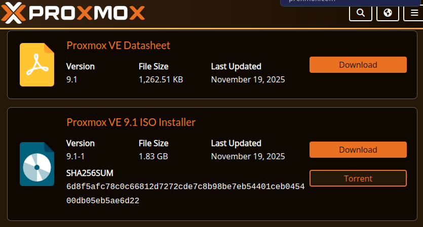

## 2. Instal·lació

### Arrencada des del pendrive

Arrenquem des del pendrive i seleccionem **Install Proxmox VE (Graphical)**.

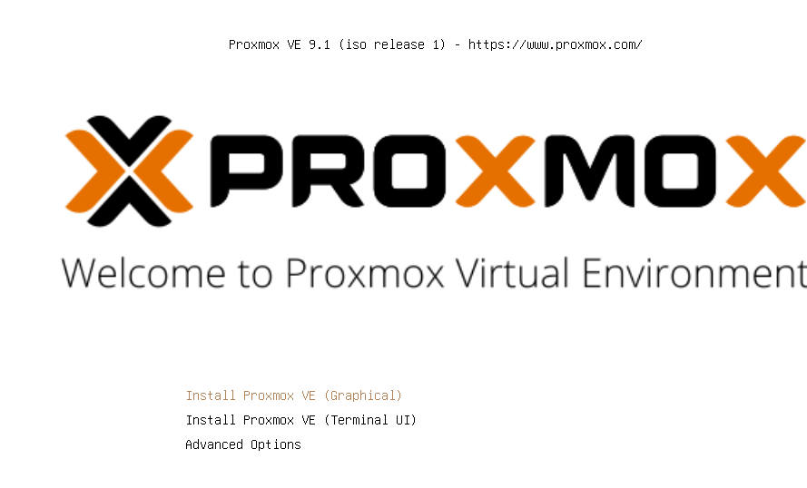

### Selecció del disc

Seleccionem el disc on s'instal·larà Proxmox. Tot el contingut del disc s'eliminarà.

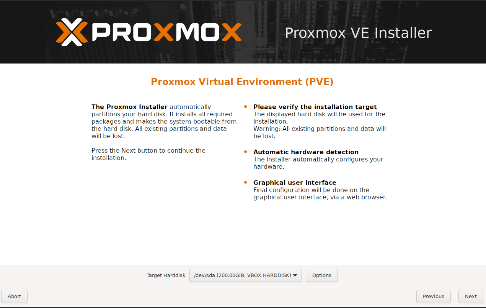

### Localització i teclat

Configuració de país, zona horària i distribució de teclat.

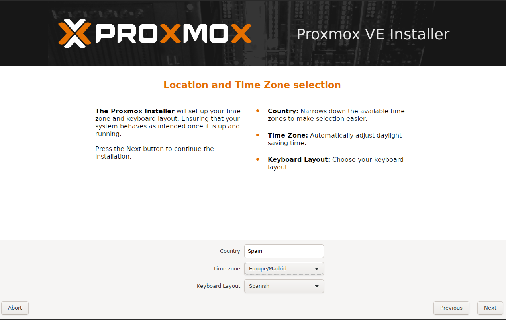

### Contrasenya i correu

Contrasenya de l'usuari `root` i correu de l'administrador.

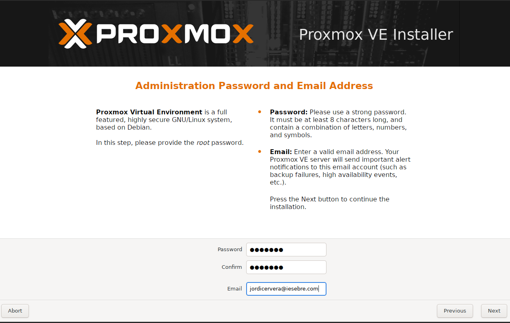

### Configuració de xarxa

Interfície de gestió amb IP estàtica, gateway i DNS.

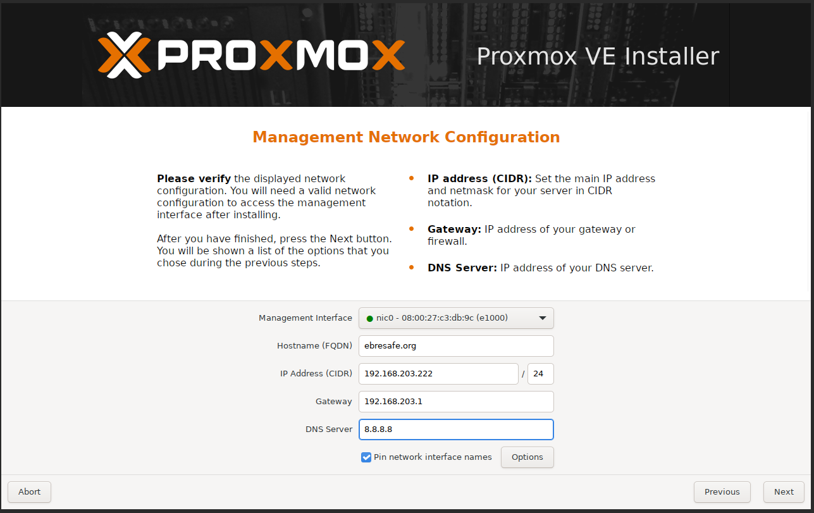

### Resum i instal·lació

Revisió de la configuració final. Cliquem **Install** per començar.

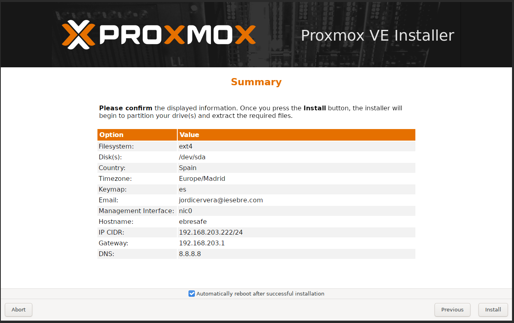

## 3. Configuració inicial

Accedim a la interfície web de Proxmox a `https://192.168.0.80:8006` i obrim la Shell del node.

### Configuració de xarxa

Editem `/etc/network/interfaces` per assignar IP estàtica al bridge `vmbr0`:

```bash
nano /etc/network/interfaces
```

```text
auto vmbr0
iface vmbr0 inet static
        address 192.168.0.80/24
        gateway 192.168.0.1
        bridge-ports nic0
        bridge-stp off
        bridge-fd 0
```

```bash
ifreload -a
```

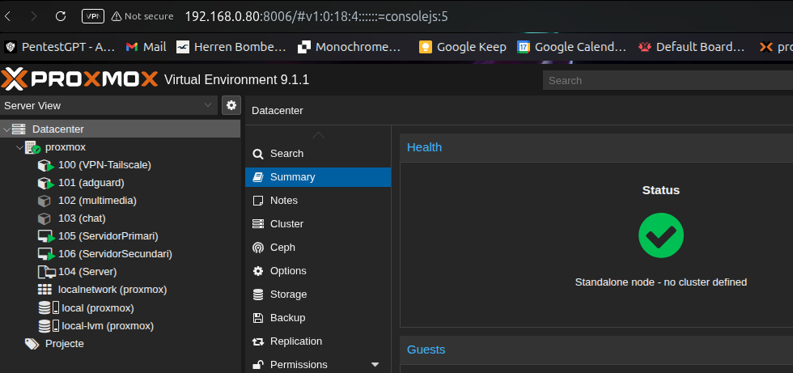

### Hostname

```bash
nano /etc/hostname
nano /etc/hosts
# 192.168.0.80    proxmox.ebresafe.org proxmox
hostnamectl set-hostname proxmox.ebresafe.org
```

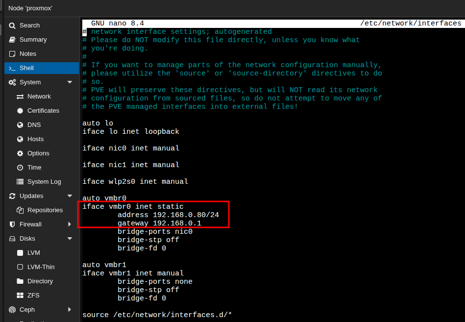

## 4. Containers LXC

Per a serveis lleugers (VPN-Tailscale, AdGuard, chat, multimèdia), utilitzem containers LXC que consumeixen menys recursos que les VMs.

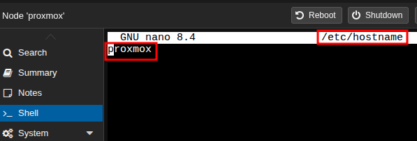

### Creació d'un container LXC

Des de la barra superior, botó **Create CT**:

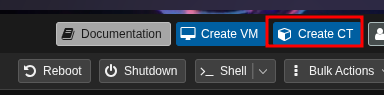

**General** — CT ID, hostname i contrasenya root:

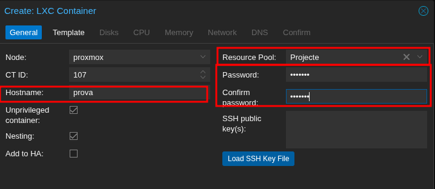

**Template** — Selecció de la plantilla (Debian 12 Standard):

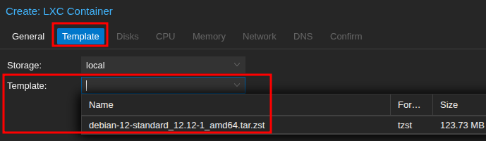

**Disks** — Mida del disc root (4-8 GiB per serveis lleugers):

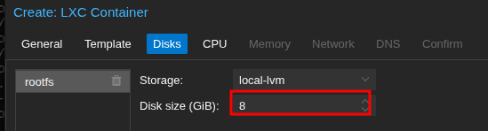

**CPU** — Nuclis assignats (1 core per serveis bàsics):

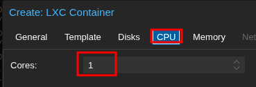

**Memory** — RAM i swap (512 MiB cadascun com a base):

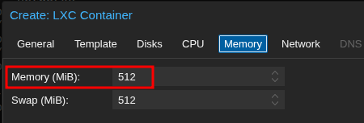

**Network** — IP estàtica al bridge `vmbr0`:

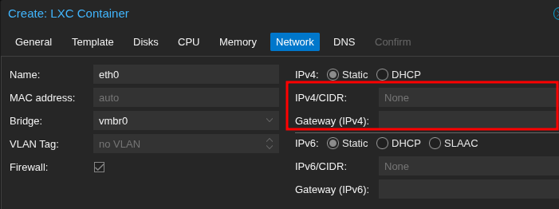

**DNS** — Configuració DNS (per defecte hereta del host):

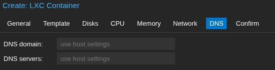

**Confirm** — Resum i creació:

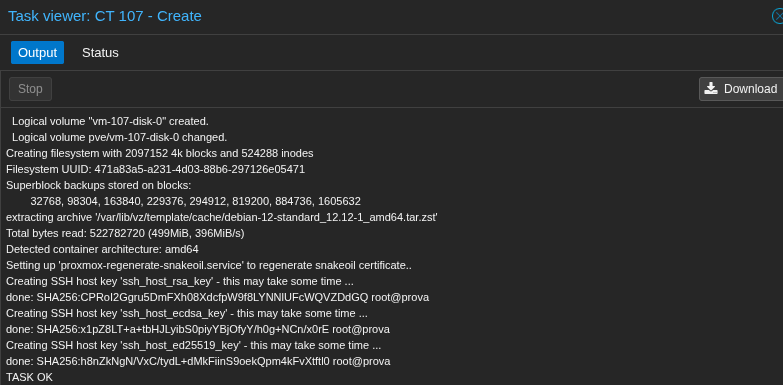

## 5. Màquines Virtuals del Projecte

Les VMs **105 (ServidorPrimari)** i **106 (ServidorSecundari)** són les màquines principals del laboratori, configurades amb Ubuntu Server per als serveis d'alta disponibilitat.

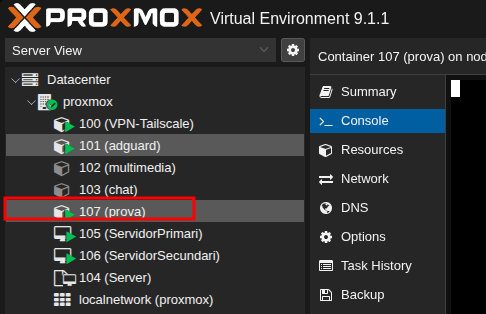

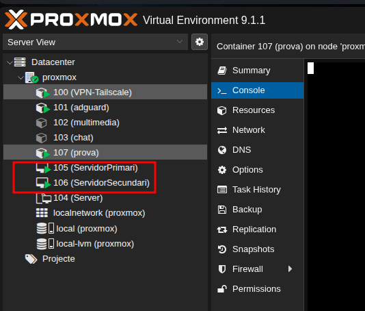

### Paràmetres de les VMs

| Paràmetre | Valor |
|-----------|-------|
| BIOS | SeaBIOS |
| Màquina | q35 |
| CPU | 2 vCPU |
| RAM | 2 GB |
| Disc | VirtIO SCSI, 20 GB |
| Xarxa | VirtIO, bridge `vmbr0` |
| SO | Ubuntu Server 22.04 LTS |

### IPs assignades

| VM | Nom | IP |
|----|-----|----|
| 105 | ServidorPrimari | `192.168.0.100` |
| 106 | ServidorSecundari | `192.168.0.101` |
| — | **VIP** (keepalived) | `192.168.0.110` |

## 6. Post-instal·lació

```bash
# Actualitzar el sistema
apt-get update && apt-get dist-upgrade -y

# Repositori no-subscription (si no hi ha llicència)
rm /etc/apt/sources.list.d/pve-enterprise.list 2>/dev/null
echo 'deb http://download.proxmox.com/debian/pve bookworm pve-no-subscription' \
  > /etc/apt/sources.list.d/pve-no-subscription.list
apt-get update
```

## Xarxa del laboratori

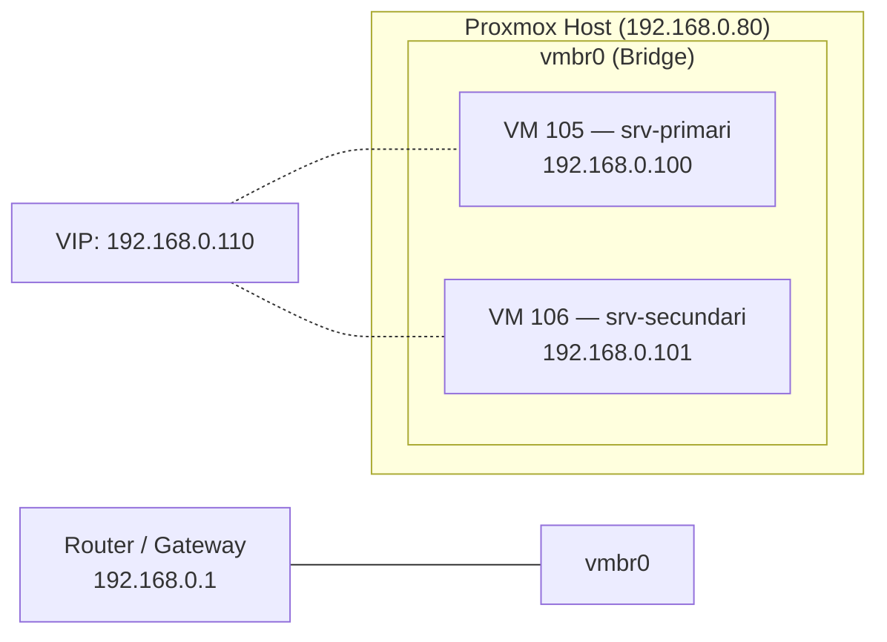
