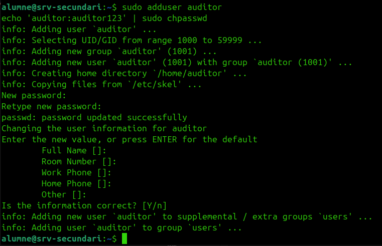
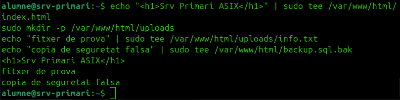

# Serveis Comuns

## Instal·lació als dos servidors

```bash
sudo apt update
sudo apt install -y openssh-server apache2 mariadb-server keepalived
```


Activar i comprovar serveis:

```bash
sudo systemctl enable ssh apache2 mariadb
sudo systemctl start ssh apache2 mariadb
sudo systemctl status ssh
sudo systemctl status apache2
sudo systemctl status mariadb
```

## Configuració comuna

### 1. Usuari de laboratori

Als dos servidors:

```bash
sudo adduser auditor
echo 'auditor:auditor123' | sudo chpasswd
```



### 2. Web de prova

=== "srv-primari"

    ```bash
    echo "<h1>Srv Primari ASIX</h1>" | sudo tee /var/www/html/index.html
    sudo mkdir -p /var/www/html/uploads
    echo "fitxer de prova" | sudo tee /var/www/html/uploads/info.txt
    echo "copia de seguretat falsa" | sudo tee /var/www/html/backup.sql.bak
    ```

=== "srv-secundari"

    ```bash
    echo "<h1>Srv Secundari ASIX</h1>" | sudo tee /var/www/html/index.html
    sudo mkdir -p /var/www/html/uploads
    echo "fitxer de prova" | sudo tee /var/www/html/uploads/info.txt
    echo "copia de seguretat falsa" | sudo tee /var/www/html/backup.sql.bak
    ```




El text diferent entre nodes permet demostrar visualment el failover.

### 3. Base de dades de prova

Als dos servidors:

```bash
sudo mysql
```

```sql
CREATE DATABASE projecte;
CREATE USER 'projecte'@'%' IDENTIFIED BY '1234';
GRANT ALL PRIVILEGES ON projecte.* TO 'projecte'@'%';
FLUSH PRIVILEGES;
EXIT;
```


