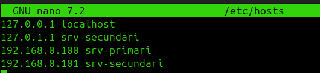
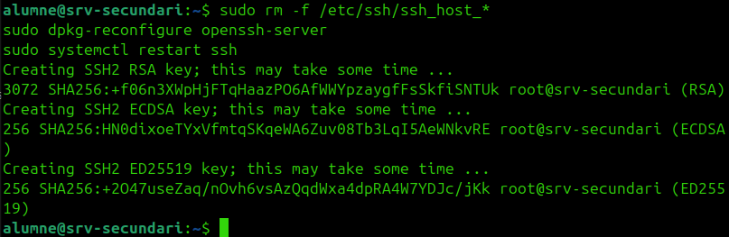

# Servidor Secundari

## Creació

| Paràmetre | Valor |
|-----------|-------|
| Nom | `srv-secundari` |
| IP | `192.168.0.101` |
| Subxarxa | Mateixa que el primari |

Comprovacions bàsiques:

```bash
ip a
hostnamectl
ping 192.168.0.100
sudo hostnamectl set-hostname srv-secundari
```

## Configuració del clon

Si el secundari és un clon de Proxmox, cal seguir aquest ordre:

1. Clonar la VM
2. Comprovar a Proxmox que la MAC del clon és diferent
3. Arrencar només el clon
4. Canviar IP, hostname i fitxer `hosts`
5. Revisar `netplan`
6. Regenerar claus SSH

### 1. Comprovar la MAC

A Proxmox: VM clonada → `Hardware` → `Network Device` → verificar que la MAC és diferent de la del primari.

### 2. Canviar hostname

```bash
sudo hostnamectl set-hostname srv-secundari
hostnamectl
```


### 3. Canviar la IP

```bash
sudo nano /etc/netplan/00-installer-config.yaml
```

```yaml
network:
  version: 2
  ethernets:
    ens18:
      dhcp4: no
      addresses:
        - 192.168.0.101/24
      nameservers:
        addresses:
          - 8.8.8.8
      routes:
        - to: default
          via: 192.168.0.1
```


```bash
sudo chmod 600 /etc/netplan/00-installer-config.yaml
sudo netplan apply
ip a
```

Si `netplan apply` dona error per conflicte amb `50-cloud-init.yaml`:

```bash
sudo mv /etc/netplan/50-cloud-init.yaml /etc/netplan/50-cloud-init.yaml.bak
sudo chmod 600 /etc/netplan/00-installer-config.yaml
sudo netplan generate
sudo netplan apply
```

Per evitar que `cloud-init` regeneri la xarxa:

```bash
echo 'network: {config: disabled}' | sudo tee /etc/cloud/cloud.cfg.d/99-disable-network-config.cfg
```

### 4. Revisar si netplan està lligat a una MAC

Si la configuració conté un bloc `match` amb la MAC antiga del primari, canviar-la o eliminar-lo.

### 5. Actualitzar `/etc/hosts`

```bash
sudo nano /etc/hosts
```

```text
127.0.0.1 localhost
127.0.1.1 srv-secundari
192.168.0.100 srv-primari
192.168.0.101 srv-secundari
```



### 6. Regenerar claus SSH del clon

```bash
sudo rm -f /etc/ssh/ssh_host_*
sudo dpkg-reconfigure openssh-server
sudo systemctl restart ssh
```



### 7. Comprovacions finals

```bash
hostnamectl
ip a
ip route
ping 192.168.0.100
ssh auditor@192.168.0.100
```
