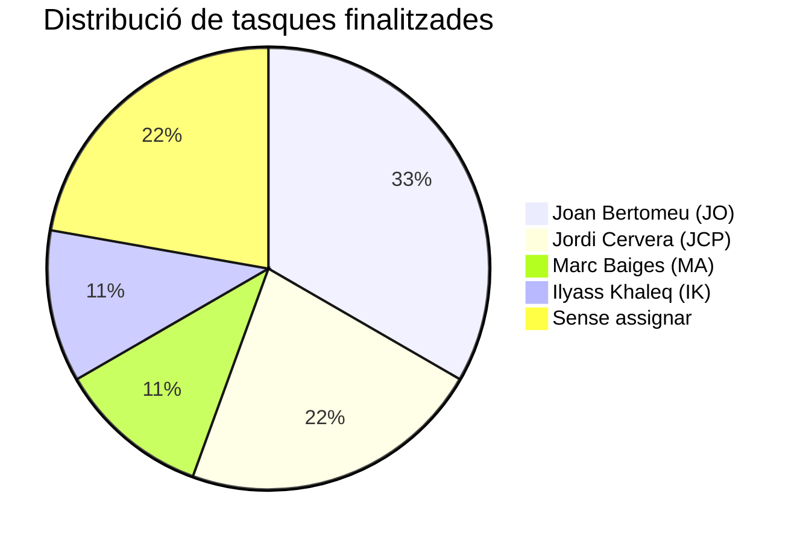

# Equip de Treball

## Membres de l'equip

| Nom | Inicials | Rol |
|-----|----------|-----|
| Jordi Cervera | JCP | Desenvolupament eina d'auditoria, Docker, Alta Disponibilitat |
| Marc Baiges | MA | Documentació, markdown, enumeració SMB |
| Joan Bertomeu | JO | Anàlisi de mercat, anàlisi de riscos, landing page |
| Ilyass Khaleq | IK | Presentació, suport configuració |

## Gestió de tasques — KanbanFlow

!!! info "Tauler Kanban"
    Hem utilitzat **KanbanFlow** per organitzar i fer el seguiment de les tasques del projecte.

    :material-link: **Enllaç al tauler:** [https://kanbanflow.com/board/eHnakJ4](https://kanbanflow.com/board/eHnakJ4)

### Captura del tauler

### Distribució de tasques

#### :material-check-circle: Finalitzades

| Tasca | Responsable | Data |
|-------|-------------|------|
| Anàlisi de mercat | Joan Bertomeu (JO) | 27/10/2025 |
| Anàlisi de Riscos | Joan Bertomeu (JO) | 27/10/2025 |
| Presentació (14/11/25) | Ilyass Khaleq (IK) | 27/10/2025 |
| Enumeració | Marc Baiges (MA) | 27/10/2025 |
| Escaneig | — | 27/10/2025 |
| Auditoria SSH | — | 27/10/2025 |
| Formació complementària | Jordi Cervera (JCP) | 06/11/2025 |
| Contracte simbòlic | Jordi Cervera (JCP) | 06/11/2025 |
| Landing page | Joan Bertomeu (JO) | 15/12/2025 |

#### :material-progress-clock: En procés

| Tasca | Responsable |
|-------|-------------|
| Markdown (documentació MkDocs) | Jordi Cervera (JCP), Marc Baiges (MA) |
| Documentació com s'ha preparat l'entorn de Proxmox | Jordi Cervera (JCP) |

#### :material-clipboard-list: A fer

| Tasca | Responsable |
|-------|-------------|
| Configuració Servidor Primari (Instal·lació bàsica) | — |
| Configuració Servidor Secundari (Instal·lació bàsica) | — |
| Millora eina d'auditoria | — |

### Resum per membre

## Metodologia de treball

!!! tip "Com hem treballat"
    - **Gestió visual** amb KanbanFlow (columnes: A Fer → En procés → Finalitzat)
    - **Control de versions** amb Git / GitHub
    - **Documentació** amb MkDocs Material
    - **Comunicació** directa i reunions periòdiques

## Eines de col·laboració

| Eina | Ús |
|------|-----|
| :material-trello: [KanbanFlow](https://kanbanflow.com/board/eHnakJ4) | Gestió de tasques (tauler Kanban) |
| :material-git: Git / GitHub | Control de versions i repositori remot |
| :material-microsoft-visual-studio-code: VS Code | Editor de codi principal |
| :material-server: Proxmox | Virtualització del laboratori |
| :material-docker: Docker | Contenidors per a distribució USB |
| :material-file-document: MkDocs | Documentació del projecte |
| :material-presentation: Canva | Presentació visual |
