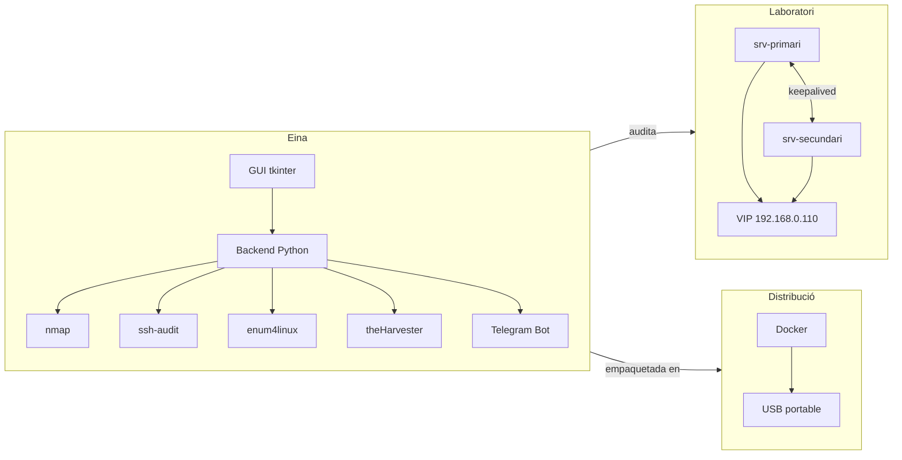
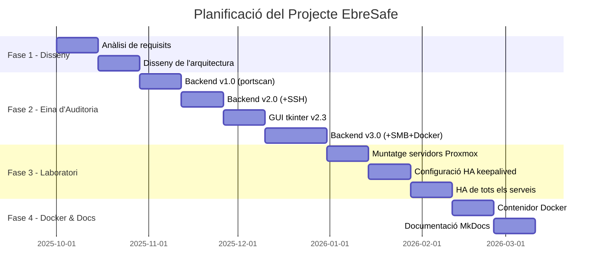

# Objectius del Projecte

## Objectiu principal

Desenvolupar una eina d'auditoria de seguretat de xarxa portable i completa, amb un laboratori d'alta disponibilitat per demostrar-ne les capacitats.

## Objectius específics

### Funcionals

- [x] Descobriment d'hosts a la xarxa local (ping scan)
- [x] Escaneig de ports amb detecció de versions (nmap -sV)
- [x] Anàlisi de vulnerabilitats amb NSE (--script vuln)
- [x] Auditoria de configuració SSH (ssh-audit)
- [x] Enumeració de recursos SMB (enum4linux)
- [x] Recollida d'informació OSINT (theHarvester)
- [x] Generació d'informes HTML i JSON
- [x] Integració amb Telegram per a enviament d'informes

### Tècnics

- [x] Interfície gràfica amb tkinter (mode local)
- [x] Mode CLI interactiu per a Docker
- [x] Contenidor Docker portable per a USB
- [x] Laboratori amb dos servidors Ubuntu a Proxmox
- [x] Alta disponibilitat amb keepalived (VIP)
- [x] Replicació MariaDB master-slave
- [x] DNS master-slave amb bind9
- [x] Sincronització de serveis amb rsync

## Abast del projecte

## Planificació

