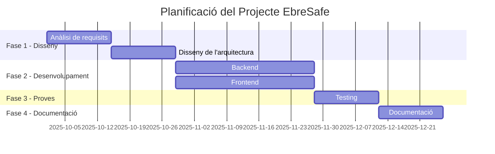

# Objectius del Projecte

## Objectius generals

!!! success "Objectiu principal"
    Defineix aquí l'objectiu principal del projecte.

<!-- TODO: Completa amb els objectius reals -->

1. **Objectiu 1:** 
2. **Objectiu 2:** 
3. **Objectiu 3:** 

## Objectius específics

### Funcionals

- [ ] Objectiu funcional 1
- [ ] Objectiu funcional 2
- [ ] Objectiu funcional 3

### Tècnics

- [ ] Objectiu tècnic 1
- [ ] Objectiu tècnic 2
- [ ] Objectiu tècnic 3

## Abast del projecte

Descriu fins on arriba el projecte i quines limitacions té.

## Planificació

