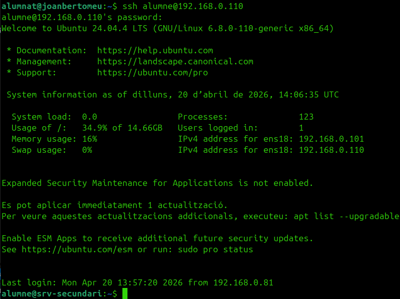
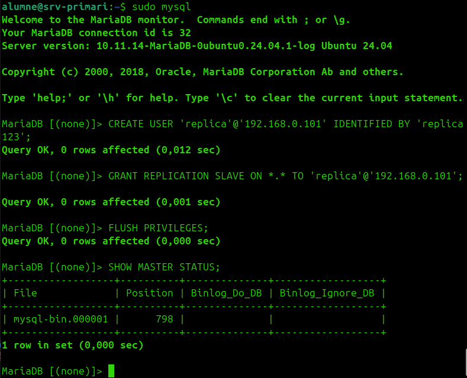
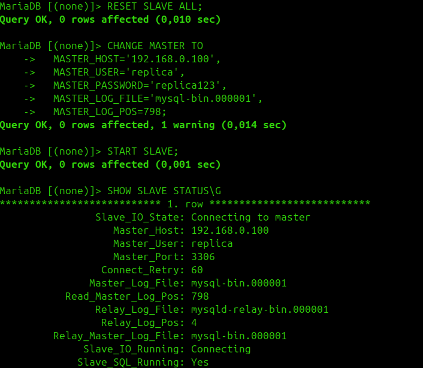
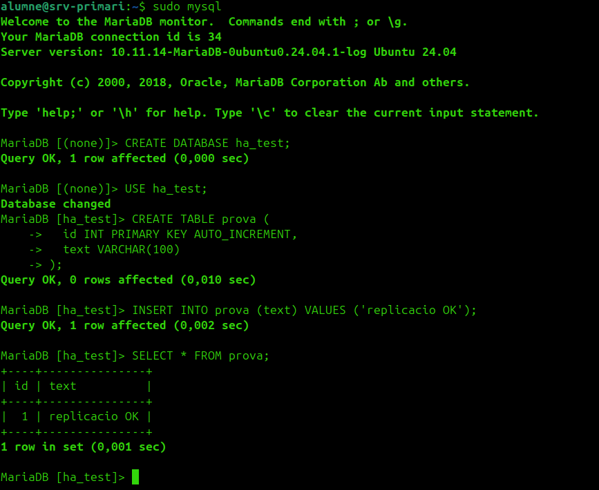
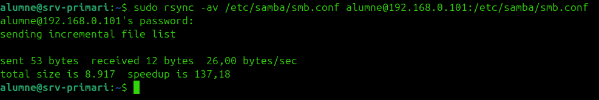
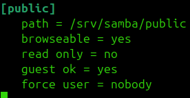

# Guia d'alta disponibilitat dels serveis ASIX

Guia pensada per al punt on ja esteu ara:

- ja teniu els serveis instal·lats
- ja teniu `keepalived` configurat
- ja heu fet la part del web abans

Aquesta guia no repeteix instal·lacions. Se centra en com deixar la resta de serveis en alta disponibilitat de manera defensable per a classe.

## Punt de partida

Suposem aquest escenari:

- `srv-primari`: `192.168.0.100`
- `srv-secundari`: `192.168.0.101`
- `VIP`: `192.168.0.110`

I que ja teniu:

- `keepalived` funcionant
- `SSH`, `Apache`, `MariaDB`, `bind9`, `vsftpd` i `Samba` instal·lats

## Com llegir aquesta guia

Per evitar confusions:

- `Al srv-primari` vol dir executar-ho a `192.168.0.100`
- `Al srv-secundari` vol dir executar-ho a `192.168.0.101`
- `Als dos servidors` vol dir fer-ho als dos
- `Des del teu PC` vol dir des de la teva màquina client, no dins de les VMs

## Idea important

`keepalived` no és un servei "d'Apache". El que fa és gestionar una IP virtual.

Per tant:

- si la `VIP` és `192.168.0.110`
- i els serveis escolten o responen en aquella IP
- quan la `VIP` passa al secundari, els serveis poden continuar disponibles

Això vol dir:

- `HTTP`, `SSH`, `FTP` i `Samba` poden aprofitar directament la mateixa `VIP`
- `MariaDB` necessita, a més, replicació de dades
- `DNS` es defensa millor com a `master/slave` que no pas només amb `VIP`

## Què presentaria jo com a alta disponibilitat real

Perquè quedi bé a la pràctica, jo ho explicaria així:

1. `keepalived` mou la `VIP` entre nodes
2. els serveis principals estan preparats als dos servidors
3. els fitxers es sincronitzen entre nodes
4. `MariaDB` replica dades
5. `DNS` funciona amb mestre i esclau

Amb això podeu dir que teniu alta disponibilitat bàsica de serveis, no només del web.

## Fase 1. Revisar `keepalived`

Com que ja el tens fet, aquí només has de revisar que la `VIP` existeixi i que el failover funcioni.

Als dos servidors, comprova:

```bash
ip a
systemctl status keepalived
```

Prova de failover:

Al primari:

```bash
sudo systemctl stop keepalived
```

Al secundari:

```bash
ip a
```

La `VIP` ha d'aparèixer al secundari.

Després torna'l a posar:

```bash
sudo systemctl start keepalived
```

## Fase 2. HA de `SSH`

Aquí l'alta disponibilitat no és de dades, sinó d'accés.

La idea és:

- `sshd` actiu als dos nodes
- configuració semblant
- connexió sempre a la `VIP`

### 1. Als dos servidors, revisar que `ssh` estigui actiu

```bash
sudo systemctl status ssh
```

### 2. Al `srv-primari`, sincronitzar configuració si cal

Només si heu tocat `sshd_config` en un node i a l'altre no:

```bash
sudo rsync -av /etc/ssh/ root@192.168.0.101:/etc/ssh/
```


### 3. Als dos servidors, reiniciar

```bash
sudo systemctl restart ssh
```


### 4. Des del teu PC, provar per la `VIP`

Des del vostre PC:

```bash
ssh alumne@192.168.0.110
```


AQUI COMPROVEM QUE FUNCIONE CORRECTAMENT:

Apaguem el primari:



Com podem observar el secundari agafa la IP del primari i ens podem conectar.


### Nota important

Si els dos servidors tenen claus host diferents, quan hi hagi failover us pot sortir l'avís de canvi d'identitat SSH. Això no vol dir que estigui malament, però cal saber-ho explicar.

## Fase 3. HA de `HTTP`

Aquesta part ja la tens feta abans. Aquí només la deixo resumida per coherència.

La idea és:

- mateixa web als dos nodes
- accés per `http://192.168.0.110`
- si cau el primari, el secundari continua responent

Des del teu PC, comprovació ràpida:

```bash
curl http://192.168.0.110
```

## Fase 4. HA de `MariaDB`

Aquí és on sí que cal fer alguna cosa més que tenir el servei instal·lat.

La manera més correcta per a la pràctica és:

- primari amb escriptura
- secundari com a rèplica

## 1. Al `srv-primari`, configurar MariaDB

Edita:

```bash
sudo nano /etc/mysql/mariadb.conf.d/50-server.cnf
```

Deixa com a mínim:

```conf
bind-address = 0.0.0.0
server-id = 1
log_bin = /var/log/mysql/mysql-bin.log
```


Reinicia:

```bash
sudo systemctl restart mariadb
```

## 2. Al `srv-primari`, crear usuari de replicació

```bash
sudo mysql
```

```sql
CREATE USER 'replica'@'192.168.0.101' IDENTIFIED BY 'replica123';
GRANT REPLICATION SLAVE ON *.* TO 'replica'@'192.168.0.101';
FLUSH PRIVILEGES;
SHOW MASTER STATUS;
```



Apunta:

- `File`
- `Position`

## 3. Al `srv-secundari`, configurar MariaDB

```bash
sudo nano /etc/mysql/mariadb.conf.d/50-server.cnf
```

```conf
bind-address = 0.0.0.0
server-id = 2
```


Reinicia:

```bash
sudo systemctl restart mariadb
```

## 4. Al `srv-secundari`, activar la rèplica

```bash
sudo mysql
```

```sql
STOP SLAVE;
CHANGE MASTER TO
  MASTER_HOST='192.168.0.100',
  MASTER_USER='replica',
  MASTER_PASSWORD='replica123',
  MASTER_LOG_FILE='mysql-bin.000001',
  MASTER_LOG_POS=TU_POSICIO;
START SLAVE;
SHOW SLAVE STATUS\G
```

Ha de sortir:

- `Slave_IO_Running: Yes`
- `Slave_SQL_Running: Yes`



## 5. Què expliques a classe

Que `MariaDB` no només depèn de la `VIP`, sinó també de la replicació de dades entre nodes.


Per a comprovar que funciona correctament creem una DB de prova



I també apareix a la bd secundària


## Fase 5. HA de `DNS`

Aquí la millor resposta tècnica no és "poso `bind9` als dos i ja està", sinó:

- `srv-primari` com a servidor mestre
- `srv-secundari` com a servidor esclau

## 1. Al `srv-primari`, configurar zona mestra

Edita:

```bash
sudo nano /etc/bind/named.conf.local
```

```conf
zone "lab.local" {
    type master;
    file "/etc/bind/db.lab.local";
    allow-transfer { 192.168.0.101; };
};
```


Crea o revisa la zona:

```bash
sudo cp /etc/bind/db.local /etc/bind/db.lab.local
sudo nano /etc/bind/db.lab.local
```

Exemple:

```dns
$TTL 604800
@   IN  SOA ns1.lab.local. admin.lab.local. (
        2
        604800
        86400
        2419200
        604800 )
@    IN  NS  ns1.lab.local.
@    IN  NS  ns2.lab.local.
ns1  IN  A   192.168.0.100
ns2  IN  A   192.168.0.101
www  IN  A   192.168.0.110
ftp  IN  A   192.168.0.110
db   IN  A   192.168.0.110
```


## 2. Al `srv-secundari`, configurar zona esclava

```bash
sudo nano /etc/bind/named.conf.local
```

```conf
zone "lab.local" {
    type slave;
    masters { 192.168.0.100; };
    file "/var/cache/bind/db.lab.local";
};
```


## 3. Als dos servidors, reiniciar `bind9`

```bash
sudo systemctl restart bind9
```

## 4. Des del teu PC o des del `srv-secundari`, provar

```bash
dig @192.168.0.100 lab.local AXFR
dig @192.168.0.101 lab.local
```


## Què diria jo

Que l'alta disponibilitat del DNS la defenseu amb redundància `master/slave`, no només amb `keepalived`.

## Fase 6. HA de `FTP`

Per a `vsftpd`, la solució més simple i defensable és actiu-passiu:

- `vsftpd` als dos nodes
- mateix directori FTP
- contingut sincronitzat
- connexió per la `VIP`

## 1. Als dos servidors, comprovar servei

```bash
sudo systemctl status vsftpd
```

## 2. Al `srv-primari`, sincronitzar directori FTP

Si feu servir, per exemple, `/srv/ftp/compartit`:

```bash
sudo rsync -av /srv/ftp/compartit/ root@192.168.0.101:/srv/ftp/compartit/
```


## 3. Al `srv-primari`, copiar configuració si cal

```bash
sudo rsync -av /etc/vsftpd.conf root@192.168.0.101:/etc/vsftpd.conf
```


## 4. Als dos servidors, reiniciar

```bash
sudo systemctl restart vsftpd
```

## 5. Des del teu PC, provar per la `VIP`

```bash
ftp 192.168.0.110
```

## Què defensar

Que l'alta disponibilitat d'FTP es basa en:

- mateix servei als dos nodes
- mateixa configuració
- mateix contingut
- `VIP` comuna

## Fase 7. HA de `Samba`

Per a classe, `Samba` també la faria en actiu-passiu:

- mateix `share`
- mateix camí
- mateixa configuració
- dades sincronitzades
- accés per la `VIP`

## 1. Als dos servidors, comprovar servei

```bash
sudo systemctl status smbd
```

## 2. Al `srv-primari`, sincronitzar directori del `share`

Si el `share` és `/srv/samba/public`:

```bash
sudo rsync -av /srv/samba/public/ alumne@192.168.0.101:/srv/samba/public/
```


## 3. Al `srv-primari`, copiar configuració si cal

```bash
sudo rsync -av /etc/samba/smb.conf alumne@192.168.0.101:/etc/samba/smb.conf
```


## 4. Als dos servidors, reiniciar

```bash
sudo systemctl restart smbd nmbd
```

## 5. Des del teu PC, provar per la `VIP`

```bash
smbclient -N //192.168.0.110/public -c "ls"
```





## Fase 8. Scripts de sincronització

Per donar sensació de muntatge seriós, jo deixaria scripts simples al primari.

## 1. Al `srv-primari`, crear script web

```bash
sudo nano /usr/local/bin/sync-web.sh
```

```bash
#!/bin/bash
rsync -av /var/www/html/ root@192.168.0.101:/var/www/html/
```

## 2. Al `srv-primari`, crear script FTP

```bash
sudo nano /usr/local/bin/sync-ftp.sh
```

```bash
#!/bin/bash
rsync -av /srv/ftp/compartit/ root@192.168.0.101:/srv/ftp/compartit/
```

## 3. Al `srv-primari`, crear script Samba

```bash
sudo nano /usr/local/bin/sync-samba.sh
```

```bash
#!/bin/bash
rsync -av /srv/samba/public/ root@192.168.0.101:/srv/samba/public/
```

Al `srv-primari`, donar permisos:

```bash
sudo chmod +x /usr/local/bin/sync-web.sh
sudo chmod +x /usr/local/bin/sync-ftp.sh
sudo chmod +x /usr/local/bin/sync-samba.sh
```

## Fase 9. Prova final de tots els serveis

Des del teu PC, comprova:

```bash
ssh alumne@192.168.0.110
curl http://192.168.0.110
ftp 192.168.0.110
smbclient -N //192.168.0.110/public -c "ls"
mysql -h 192.168.0.110 -u root -p
dig @192.168.0.110 lab.local
```

Ara, al `srv-primari`, simula caiguda:

```bash
sudo systemctl stop keepalived
```

I repeteix les proves.

## Què dir a la presentació

Una frase bona seria aquesta:

> Hem aprofitat una IP virtual gestionada per keepalived perquè diversos serveis continuïn disponibles després d'un failover. A més, per als serveis amb estat o dades, hem afegit sincronització o replicació entre nodes.

## Resum tècnic correcte

`keepalived`:

- no és només per a `Apache`
- és per a la `VIP`

La `VIP` us serveix per:

- `SSH`
- `HTTP`
- `FTP`
- `Samba`
- `MariaDB` si el servei està preparat al segon node

El `DNS` és millor defensar-lo com:

- `master/slave`

## Mínim que jo deixaria perfecte

Si vols una versió molt defensable i sense embolicar-te massa:

1. `keepalived` amb `VIP` funcional
2. `SSH` i `HTTP` responent per la `VIP`
3. `FTP` i `Samba` sincronitzats amb `rsync`
4. `DNS` amb `master/slave`
5. `MariaDB` amb rèplica simple

Amb això queda molt millor explicat i no sembla que `keepalived` sigui només "la part del web".
