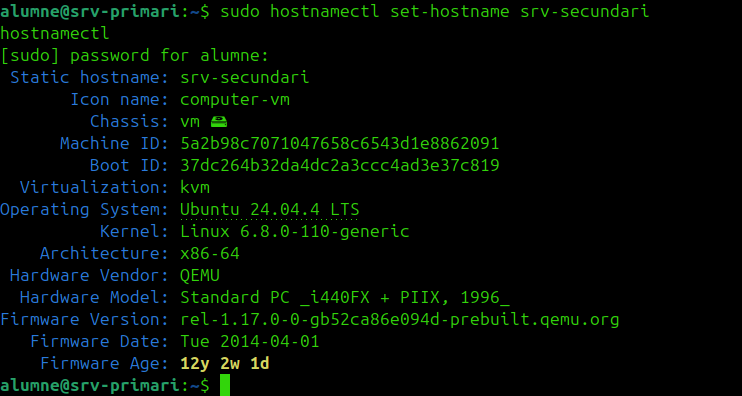
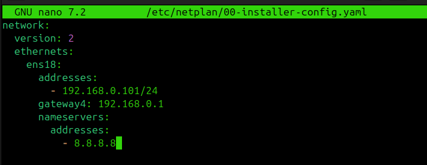
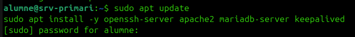
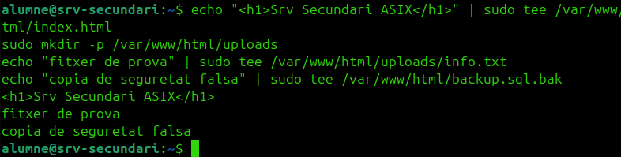
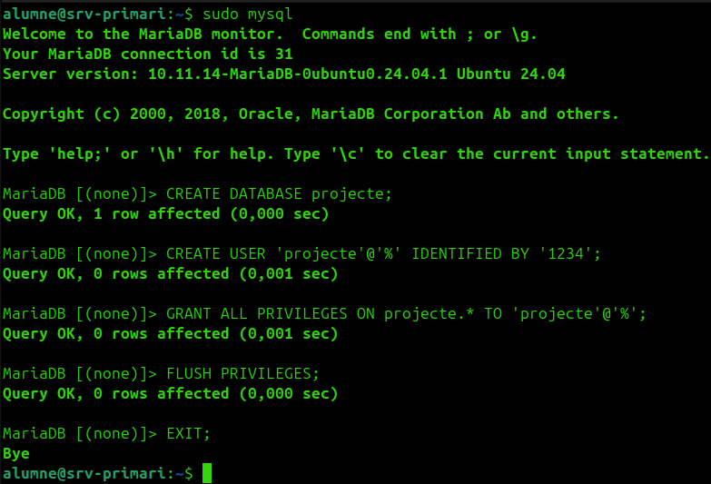
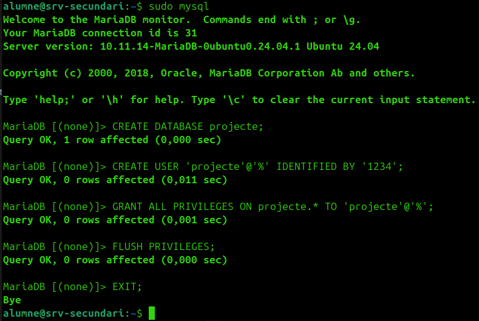
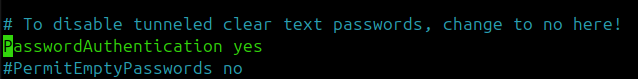
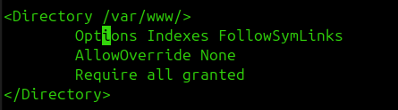
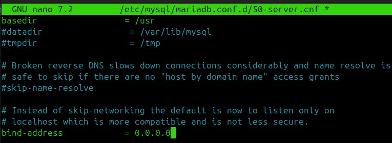

# Guia del laboratori ASIX amb alta disponibilitat

Guia pràctica per muntar el laboratori dins de Proxmox sense complicar-lo més del compte.

L'objectiu és tenir:

- dos servidors Ubuntu
- alta disponibilitat bàsica entre tots dos
- serveis vulnerables perquè la vostra eina d'auditoria tingui coses útils a detectar

## Escenari recomanat

- `srv-primari`: `192.168.0.100`
- `srv-secundari`: `192.168.0.101`
- IP virtual d'alta disponibilitat: `192.168.0.110`

La IP virtual serà la que mourà `keepalived` entre els dos servidors quan caigui el node principal.

## Idea general

Per no passar-vos de complexitat, jo ho faria així:

- als dos servidors:
  - `SSH`
  - `Apache`
  - `MariaDB`
  - `keepalived`
- al `srv-secundari`, a més:
  - `bind9`
  - `vsftpd`
  - `Samba`

Amb això podeu defensar:

- alta disponibilitat del servei web amb IP virtual
- redundància bàsica entre dos nodes
- un conjunt de serveis vulnerables suficient per a l'auditoria

## Què és l'alta disponibilitat en aquesta pràctica

La part important és que si cau `srv-primari`, el `srv-secundari` pugui continuar responent a la IP virtual.

Per tant:

- `Apache` ha d'estar als dos servidors
- la web de prova ha de ser igual als dos servidors
- `keepalived` ha de gestionar la IP virtual

`MariaDB` la podeu tenir als dos servidors per auditar-la i per justificar redundància, però si voleu anar al mínim viable, la part de HA que jo presentaria sí o sí és la del web amb `keepalived`.

## Fase 0. Preparació

### 1. Comprovar l'estat actual del primari

Al `srv-primari`:

```bash
ip a
hostnamectl
sudo apt update && sudo apt upgrade -y
```

Si encara no ho has fet:

```bash
sudo hostnamectl set-hostname srv-primari
```

### 2. Crear snapshot

Quan el sistema estigui net i actualitzat, fes un snapshot a Proxmox.

Nom recomanat:

```text
ubuntu-base-neta
```

## Fase 1. Crear el servidor secundari

Crea una segona Ubuntu Server amb la mateixa xarxa que el primari.

Configuració recomanada:

- nom: `srv-secundari`
- IP: `192.168.0.101`
- mateixa subxarxa que el primari

Comprovacions bàsiques:

```bash
ip a
hostnamectl
ping 192.168.0.100
```

Posa-li el nom:

```bash
sudo hostnamectl set-hostname srv-secundari
```

També faria un snapshot quan quedi operatiu.

### Si el secundari és un clon de Proxmox

Si clones la VM del primari, normalment Proxmox generarà una MAC nova per a la targeta de xarxa del clon. Tot i això, has de revisar la configuració interna d'Ubuntu abans d'arrencar els dos servidors alhora.

Ordre recomanat:

1. clonar la VM
2. comprovar a Proxmox que la MAC del clon és diferent
3. arrencar només el clon
4. canviar IP, hostname i fitxer `hosts`
5. revisar `netplan`
6. regenerar claus SSH si voleu que siguin dos nodes completament separats

#### 1. Comprovar la MAC del clon

A Proxmox:

- entra a la VM clonada
- ves a `Hardware`
- entra a `Network Device`
- comprova que la MAC no sigui la mateixa que la del primari

Si fos la mateixa, canvia-la des de Proxmox abans d'arrencar la màquina.

#### 2. Canviar hostname

Al clon:

```bash
sudo hostnamectl set-hostname srv-secundari
hostnamectl
```



#### 3. Canviar la IP

Edita el fitxer de `netplan`. Per exemple:

```bash
sudo nano /etc/netplan/00-installer-config.yaml
```


O bé:

```bash
ls /etc/netplan/
```

Exemple de configuració per al secundari:

```yaml
network:
  version: 2
  ethernets:
    ens18:
      dhcp4: no
      addresses:
        - 192.168.0.101/24
      nameservers:
        addresses:
          - 8.8.8.8
      routes:
        - to: default
          via: 192.168.0.1
```



Aplica canvis:

```bash
sudo chmod 600 /etc/netplan/00-installer-config.yaml
sudo netplan apply
ip a
```

Si `netplan apply` dona error, comprova si tens més d'un fitxer YAML configurant la mateixa interfície:

```bash
ls -l /etc/netplan/
sudo grep -R "ens18\\|gateway4\\|routes:" /etc/netplan
```

Si hi ha dos fitxers definint `ens18`, deixa'n només un actiu o elimina la configuració duplicada.

Cas típic després de clonar una Ubuntu Server:

- `00-installer-config.yaml`
- `50-cloud-init.yaml`

Si tots dos configuren `ens18`, tindràs conflictes de ruta o dues IPs a la mateixa interfície.

Solució recomanada:

```bash
sudo mv /etc/netplan/50-cloud-init.yaml /etc/netplan/50-cloud-init.yaml.bak
sudo chmod 600 /etc/netplan/00-installer-config.yaml
sudo netplan generate
sudo netplan apply
```

Si en algun reinici `cloud-init` et torna a generar la xarxa, desactiva la seva gestió de xarxa:

```bash
echo 'network: {config: disabled}' | sudo tee /etc/cloud/cloud.cfg.d/99-disable-network-config.cfg
```

Després comprova:

```bash
ip a
ip route
```

En el `srv-secundari` només hauria de quedar la IP `192.168.0.101/24` a `ens18`.

#### 4. Revisar si `netplan` està lligat a una MAC

Algunes configuracions de `netplan` poden tenir una secció com aquesta:

```yaml
match:
  macaddress: aa:bb:cc:dd:ee:ff
```

Si hi surt la MAC antiga del primari, tens dues opcions:

- canviar-la per la MAC nova del clon
- o eliminar el bloc `match` si no el necessites

Exemple:

```yaml
network:
  version: 2
  ethernets:
    ens18:
      dhcp4: no
      addresses:
        - 192.168.0.101/24
      nameservers:
        addresses:
          - 8.8.8.8
      routes:
        - to: default
          via: 192.168.0.1
```

Després:

```bash
sudo chmod 600 /etc/netplan/00-installer-config.yaml
sudo netplan apply
```

#### 5. Actualitzar `/etc/hosts`

Edita:

```bash
sudo nano /etc/hosts
```

Exemple:

```text
127.0.0.1 localhost
127.0.1.1 srv-secundari
192.168.0.100 srv-primari
192.168.0.101 srv-secundari
```


#### 6. Regenerar claus SSH del clon

Això no és obligatori, però és recomanable si voleu que el primari i el secundari siguin dues màquines realment independents.

```bash
sudo rm -f /etc/ssh/ssh_host_*
sudo dpkg-reconfigure openssh-server
sudo systemctl restart ssh
```


#### 7. Comprovacions finals del clon

```bash
hostnamectl
ip a
ip route
ping 192.168.0.100
ssh auditor@192.168.0.100
```

Quan això funcioni, ja pots arrencar alhora el primari i el secundari sense risc de conflicte bàsic de xarxa.

## Fase 2. Instal·lar els serveis comuns als dos servidors

Executa això tant al primari com al secundari:

```bash
sudo apt update
sudo apt install -y openssh-server apache2 mariadb-server keepalived
```



Comprova serveis:

```bash
sudo systemctl enable ssh apache2 mariadb
sudo systemctl start ssh apache2 mariadb
sudo systemctl status ssh
sudo systemctl status apache2
sudo systemctl status mariadb
```

## Fase 3. Configuració comuna dels dos nodes

### 1. Crear usuari de laboratori

Fes-ho als dos servidors:

```bash
sudo adduser auditor
echo 'auditor:auditor123' | sudo chpasswd
```


### 2. Crear una web igual als dos servidors

Al `srv-primari`:

```bash
echo "<h1>Srv Primari ASIX</h1>" | sudo tee /var/www/html/index.html
sudo mkdir -p /var/www/html/uploads
echo "fitxer de prova" | sudo tee /var/www/html/uploads/info.txt
echo "copia de seguretat falsa" | sudo tee /var/www/html/backup.sql.bak
```

Al `srv-secundari`:

```bash
echo "<h1>Srv Secundari ASIX</h1>" | sudo tee /var/www/html/index.html
sudo mkdir -p /var/www/html/uploads
echo "fitxer de prova" | sudo tee /var/www/html/uploads/info.txt
echo "copia de seguretat falsa" | sudo tee /var/www/html/backup.sql.bak
```




No cal que el text sigui idèntic. De fet, va bé que sigui diferent perquè així podeu demostrar visualment el failover.

### 3. Crear una base de dades de prova

Fes-ho als dos servidors:

```bash
sudo mysql
```

```sql
CREATE DATABASE projecte;
CREATE USER 'projecte'@'%' IDENTIFIED BY '1234';
GRANT ALL PRIVILEGES ON projecte.* TO 'projecte'@'%';
FLUSH PRIVILEGES;
EXIT;
```




## Fase 4. Vulnerabilitats del primari i del secundari

La idea és tenir vulnerabilitats senzilles, visibles i fàcils de justificar.

### 1. SSH insegur als dos servidors

Edita als dos nodes:

```bash
sudo nano /etc/ssh/sshd_config
```

Deixa actiu:

```text
PasswordAuthentication yes
PermitRootLogin yes
```




Reinicia:

```bash
sudo systemctl restart ssh
```

Què hauria de detectar la vostra eina:

- port `22` obert
- servei `OpenSSH`
- autenticació per contrasenya habilitada
- hardening pobre

### 2. Apache feble als dos servidors

Edita als dos nodes:

```bash
sudo nano /etc/apache2/apache2.conf
```

Deixa la secció de `/var/www/` semblant a:

```apache
<Directory /var/www/>
    Options Indexes FollowSymLinks
    AllowOverride None
    Require all granted
</Directory>
```

Reinicia:

```bash
sudo systemctl restart apache2
```



Què hauria de detectar la vostra eina:

- port `80` obert
- servidor `Apache`
- headers de seguretat absents
- directori navegable
- fitxer sensible visible (`backup.sql.bak`)

### 3. MariaDB massa exposat als dos servidors

Edita als dos nodes:

```bash
sudo nano /etc/mysql/mariadb.conf.d/50-server.cnf
```

Canvia:

```text
bind-address = 127.0.0.1
```

per:

```text
bind-address = 0.0.0.0
```



Reinicia:

```bash
sudo systemctl restart mariadb
```

Què hauria de detectar la vostra eina:

- port `3306` obert
- servei `MariaDB`
- accés remot habilitat
- usuari amb permisos excessius

## Fase 5. Alta disponibilitat amb Keepalived

Aquesta és la part clau de la pràctica.

### 1. Comprovar la interfície de xarxa

Als dos servidors:

```bash
ip a
```

Apunta el nom de la interfície. En molts casos serà `ens18` o `eth0`.

En els exemples d'aquesta guia faré servir `ens18`. Si la teva és una altra, canvia-la.

### 2. Configuració del primari

Edita:

```bash
sudo nano /etc/keepalived/keepalived.conf
```

Posa això:

```conf
global_defs {
    enable_script_security
}

vrrp_script chk_apache {
    script "/usr/bin/pgrep apache2"
    interval 2
    weight -60
}

vrrp_instance VI_1 {
    state MASTER
    interface ens18
    virtual_router_id 51
    priority 150
    advert_int 1
    authentication {
        auth_type PASS
        auth_pass asixha
    }
    track_script {
        chk_apache
    }
    virtual_ipaddress {
        192.168.0.110/24
    }
}
```

### 3. Configuració del secundari

Edita:

```bash
sudo nano /etc/keepalived/keepalived.conf
```

Posa això:

```conf
global_defs {
    enable_script_security
}

vrrp_script chk_apache {
    script "/usr/bin/pgrep apache2"
    interval 2
    weight -60
}

vrrp_instance VI_1 {
    state BACKUP
    interface ens18
    virtual_router_id 51
    priority 100
    advert_int 1
    authentication {
        auth_type PASS
        auth_pass asixha
    }
    track_script {
        chk_apache
    }
    virtual_ipaddress {
        192.168.0.110/24
    }
}
```

### 4. Reiniciar el servei

Als dos nodes:

```bash
sudo systemctl enable keepalived
sudo systemctl restart keepalived
sudo systemctl status keepalived
```

### 5. Comprovació de la IP virtual

Primer comprova al primari:

```bash
ip a | grep 192.168.0.110
```

Ha d'aparèixer la IP virtual al `srv-primari`.

Després prova l'accés:

```bash
curl http://192.168.0.110
```


## Fase 6. Prova de failover

Aquest és el test que us donarà més joc a la presentació.

### 1. Amb el primari actiu

```bash
curl http://192.168.0.110
```

Hauries de veure la pàgina del `srv-primari`.

### 2. Simular caiguda del primari

Atura `keepalived` al primari:

```bash
sudo systemctl stop keepalived
```

O bé atura Apache:

```bash
sudo systemctl stop apache2
```

### 3. Comprovar el secundari

Al `srv-secundari`:

```bash
ip a | grep 192.168.0.110
```

Ara la IP virtual hauria d'haver passat al segon node.

Des d'una altra màquina:

```bash
curl http://192.168.0.110
```

Hauries de veure la pàgina del `srv-secundari`.


### 4. Recuperar el primari

```bash
sudo systemctl start apache2
sudo systemctl start keepalived
```

## Fase 7. Serveis extra al servidor secundari

Aquests serveis us donaran més superfície d'auditoria, però no són la part principal del HA.

Instal·la al `srv-secundari`:

```bash
sudo apt install -y bind9 vsftpd samba
```

### 1. DNS amb bind9

Idea recomanada:

- `srv-primari`: DNS mestre
- `srv-secundari`: DNS esclau

Vulnerabilitats que podeu simular:

- transferència de zona oberta
- versió del servei visible

### 2. FTP amb vsftpd

Vulnerabilitats recomanades:

- accés anònim activat
- carpeta pública amb fitxers de prova

Exemples de fitxers:

- `inventari.txt`
- `copia.sql`

### 3. Samba

Vulnerabilitats recomanades:

- recurs compartit amb permisos massa amplis
- lectura anònima dins del laboratori

Exemples de fitxers:

- `backup.sql`
- `usuaris.txt`
- `config_old.conf`

## Fase 8. Verificació amb la vostra eina o amb escaneig bàsic

### 1. Escaneig dels dos nodes

```bash
nmap -sV 192.168.0.100
nmap -sV 192.168.0.101
```

### 2. Escaneig de la IP virtual

```bash
nmap -sV 192.168.0.110
```

### 3. Proves manuals útils

```bash
curl http://192.168.0.100
curl http://192.168.0.101
curl http://192.168.0.110
curl http://192.168.0.110/backup.sql.bak
curl http://192.168.0.110/uploads/
```

## Què hauria de detectar la vostra eina

Com a mínim:

- ports oberts
- servei detectat
- IP virtual activa
- servei web redundant
- `SSH` amb configuració dèbil
- fitxers sensibles accessibles al web
- directori web navegable
- `MariaDB` amb accés remot
- `DNS` amb transferència de zona oberta
- `FTP` anònim
- recurs `Samba` amb permisos insegurs

## Evidències per a la memòria

Guardeu:

- captures de `ip a`
- estat de `keepalived`
- resultat abans i després del failover
- sortida de l'escaneig
- proves d'accés al backup des del web

Taula final recomanada:

- servei
- node afectat
- vulnerabilitat
- evidència
- risc
- recomanació

## Mínim viable si aneu justos de temps

Si veieu que no arribeu a tot, jo presentaria això com a mínim:

- `srv-primari` i `srv-secundari` amb `SSH`, `Apache`, `MariaDB` i `keepalived`
- IP virtual `192.168.0.110`
- failover funcional del web
- vulnerabilitats de `SSH`, `Apache` i `MariaDB`
- al secundari, com a extra, `FTP` o `Samba`

Amb això ja podeu defensar:

- alta disponibilitat real
- serveis auditables
- configuracions insegures clares

## Llista curta de control

- [ ] `srv-primari` amb IP `192.168.0.100`
- [ ] `srv-secundari` amb IP `192.168.0.101`
- [ ] `keepalived` instal·lat als dos nodes
- [ ] IP virtual `192.168.0.110` configurada
- [ ] `Apache` funcionant als dos nodes
- [ ] `MariaDB` funcionant als dos nodes
- [ ] usuari `auditor` creat als dos nodes
- [ ] `PasswordAuthentication yes`
- [ ] `PermitRootLogin yes`
- [ ] directori `/uploads/` navegable
- [ ] fitxer `backup.sql.bak` accessible
- [ ] prova de failover feta correctament

## Nota final

No intentis fer una alta disponibilitat perfecta de tot. Per aquesta pràctica, el més intel·ligent és demostrar bé la IP virtual amb `keepalived`, tenir els dos nodes preparats, i afegir unes quantes vulnerabilitats clares perquè la vostra eina d'auditoria pugui lluir.
